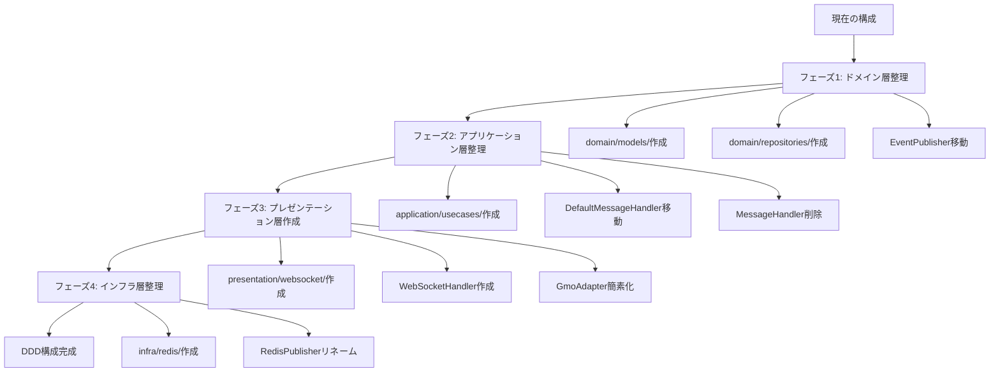

# DDD構成への移行プラン

## 目的

現在のレイヤードアーキテクチャをDDD構成に移行し、責務の分離を明確化します。以下の目標ディレクトリ構成を実現します：

```
collector/
└── src/
    ├── main.ts
    ├── presentation/ (外部からの入力口)
    │   └── websocket/
    │       ├── WebSocketHandler.ts      (WS接続の維持・メッセージ受信)
    │       └── ConnectionManager.ts    (接続管理)
    ├── application/  (ビジネスプロセスの制御)
    │   └── usecases/
    │       └── PublishStreamUsecase.ts  (受信データを検証しStreamへ投げる司令塔)
    ├── domain/       (業務ルールとインターフェース)
    │   ├── models/           (扱うデータの型・値オブジェクト)
    │   │   └── NormalizedEvent.ts
    │   └── repositories/
    │       └── StreamPublisher.ts      (Redis等への保存口となるインターフェース)
    └── infra/        (具体的な技術実装)
        └── redis/
            └── StreamRepository.ts      (Redis StreamへのXADD等の実処理)
```

## 移行フロー



## フェーズ1: ドメイン層の整理

### 目的

型定義とリポジトリインターフェースをドメイン層に適切に配置する

### 変更内容

1. **ディレクトリ作成**

   - `services/collector/src/domain/models/` を作成
   - `services/collector/src/domain/repositories/` を作成

2. **ファイル移動・分割**

   - `domain/types.ts` → `domain/models/NormalizedEvent.ts` に移動
     - `git mv` を使用してファイルを移動（Git履歴を保持）
     - `MarketDataType` と `NormalizedEvent` を移動
   - `application/interfaces/EventPublisher.ts` → `domain/repositories/StreamPublisher.ts` に移動・リネーム
     - `git mv` を使用してファイルを移動（Git履歴を保持）
     - インターフェース名を `EventPublisher` → `StreamPublisher` に変更
     - メソッド名を `publish` → `publish` のまま（変更なし）

3. **インポートパスの更新**

   - `application/interfaces/EventPublisher.ts` を参照しているファイル:
     - `application/handlers/DefaultMessageHandler.ts`
     - `infrastructure/redis/RedisPublisher.ts`
   - `domain/types.ts` を参照しているファイル:
     - `application/interfaces/MessageParser.ts`
     - `infrastructure/adapters/gmo/GmoMessageParser.ts`
     - `infrastructure/redis/RedisPublisher.ts`
     - テストファイル（複数）

### 影響範囲

- インポートパスの更新のみ（機能変更なし）
- テストファイルも含めてすべて更新

## フェーズ2: アプリケーション層の整理

### 目的

usecase を明確に分離し、`MessageHandler` インターフェースを削除

### 変更内容

1. **ディレクトリ作成**

   - `services/collector/src/application/usecases/` を作成

2. **ファイル移動・リネーム**

   - `application/handlers/DefaultMessageHandler.ts` → `application/usecases/PublishStreamUsecase.ts`
     - `git mv` を使用してファイルを移動（Git履歴を保持）
     - クラス名を `DefaultMessageHandler` → `PublishStreamUsecase` に変更
     - メソッド名を `handle` → `execute` に変更
     - `MessageHandler` インターフェースの実装を削除（通常のクラスに）

3. **インターフェースの削除**

   - `application/interfaces/MessageHandler.ts` を削除

4. **依存関係の更新**

   - `GmoAdapter.ts`: `MessageHandler` → `PublishStreamUsecase` に変更
     - `handleMessage` メソッド内で `messageHandler.handle()` → `usecase.execute()` に変更
   - `main.ts`: `DefaultMessageHandler` → `PublishStreamUsecase` に変更

### 影響範囲

- `GmoAdapter` の依存関係変更
- `main.ts` の依存関係変更
- テストファイルの更新

## フェーズ3: プレゼンテーション層の作成

### 目的

WebSocket 接続管理を presentation 層に移動し、`GmoAdapter` を簡素化

### 変更内容

1. **ディレクトリ作成**

   - `services/collector/src/presentation/websocket/` を作成

2. **新規ファイル作成**

   - `presentation/websocket/WebSocketHandler.ts` を作成
     - `GmoAdapter` の接続管理部分（`connect`, `disconnect`, `start`）を抽出
     - `MarketDataAdapter` を使用して接続を管理
     - `PublishStreamUsecase` を使用してメッセージを処理
   - `presentation/websocket/ConnectionManager.ts` を作成（オプション）
     - `ReconnectManager` のラッパーとして機能
     - または `WebSocketHandler` 内に統合

3. **GmoAdapter の簡素化**

   - `GmoAdapter` から接続管理部分を削除
   - `connect()`, `disconnect()`, `start()` メソッドを削除または簡素化
   - `MarketDataAdapter` インターフェースの実装を維持
   - 主な責務: 取引所固有の WebSocket プロトコル実装（接続、購読、メッセージパース）

4. **main.ts の更新**

   - `WebSocketHandler` を使用するように変更
   - `GmoAdapter` は `WebSocketHandler` の内部で使用

### 新しい責務分担

- **`presentation/websocket/WebSocketHandler`**: 
  - WebSocket 接続の維持・メッセージ受信
  - 再接続管理
  - メッセージを usecase に委譲

- **`application/usecases/PublishStreamUsecase`**: 
  - 受信データの検証
  - Stream への配信

- **`infrastructure/adapters/gmo/GmoAdapter`**: 
  - 取引所固有の WebSocket プロトコル実装
  - 接続、購読、メッセージパース

## フェーズ4: インフラ層の整理

### 目的

リポジトリ実装を明確化し、ディレクトリ名を `infrastructure` → `infra` に変更

### 変更内容

1. **ディレクトリリネーム（オプション）**

   - `infrastructure/` → `infra/` にリネーム
     - `git mv` を使用してディレクトリをリネーム（Git履歴を保持）
   - または `infrastructure/` のまま維持（プロジェクト方針による）

2. **ファイルリネーム**

   - `infrastructure/redis/RedisPublisher.ts` → `infra/redis/StreamRepository.ts`
     - `git mv` を使用してファイルをリネーム（Git履歴を保持）
     - クラス名を `RedisPublisher` → `StreamRepository` に変更
     - `domain/repositories/StreamPublisher` インターフェースを実装

3. **インポートパスの更新**

   - `main.ts`
   - テストファイル（複数）

### 影響範囲

- インポートパスの更新
- クラス名の変更に伴う参照の更新

## 実装の詳細

### フェーズ1: ドメイン層の整理

**作成するファイル:**

- `domain/models/NormalizedEvent.ts`
- `domain/repositories/StreamPublisher.ts`

**削除するファイル:**

- `domain/types.ts`
- `application/interfaces/EventPublisher.ts`

### フェーズ2: アプリケーション層の整理

**作成するファイル:**

- `application/usecases/PublishStreamUsecase.ts`

**削除するファイル:**

- `application/handlers/DefaultMessageHandler.ts`
- `application/interfaces/MessageHandler.ts`

### フェーズ3: プレゼンテーション層の作成

**作成するファイル:**

- `presentation/websocket/WebSocketHandler.ts`
- `presentation/websocket/ConnectionManager.ts`（オプション）

**変更するファイル:**

- `infrastructure/adapters/gmo/GmoAdapter.ts`（大幅な簡素化）
- `main.ts`（依存関係の変更）

### フェーズ4: インフラ層の整理

**リネームするファイル:**

- `infrastructure/redis/RedisPublisher.ts` → `infra/redis/StreamRepository.ts`

**変更するファイル:**

- `main.ts`
- テストファイル（複数）

## テスト戦略

各フェーズの実装後、以下の順序で検証を実行します：

### 検証手順

1. **型チェック**: `npm run type-check`

   - TypeScriptの型エラーがないことを確認

2. **Lint チェック**: `npm run lint`

   - コードスタイルと品質の問題がないことを確認

3. **ユニットテスト**: `npm run test:unit`

   - すべてのユニットテストが成功することを確認
   - 実行場所: `services/collector` ディレクトリ

4. **統合テスト**: `npm run test:integration`

   - Redisコンテナを起動してから実行
   - 実行前の準備:
     ```bash
     # プロジェクトルートから実行
     docker-compose -f docker-compose.local.yml up -d redis
     ```

   - 実行場所: `services/collector` ディレクトリ
   - 環境変数: `REDIS_URL=redis://localhost:6379/0` を設定（オプション、デフォルト値）

### 各フェーズでの検証タイミング

- **フェーズ1**: ドメイン層の整理後
- **フェーズ2**: アプリケーション層の整理後
- **フェーズ3**: プレゼンテーション層の作成後
- **フェーズ4**: インフラ層の整理後（最終検証）

### 注意事項

- 統合テストは実際のRedisサーバーが必要なため、事前にRedisコンテナを起動する必要があります
- 各フェーズでテストが失敗した場合は、次のフェーズに進まずに問題を解決してください
- テストがすべて成功することを確認してから、次のフェーズに進みます

## 注意事項

1. **段階的移行**: 各フェーズを完了してから次のフェーズに進む
2. **後方互換性**: 各フェーズで既存のテストが通ることを確認
3. **依存関係の方向**: 常に外側から内側への依存を維持

   - presentation → application → domain ← infrastructure

4. **git 履歴の保持**: **すべてのファイル移動・リネームは `git mv` を使用する**

   - ファイル移動: `git mv <old_path> <new_path>`
   - ディレクトリリネーム: `git mv <old_dir> <new_dir>`
   - これにより、Git履歴が保持され、ファイルの変更履歴を追跡できる

## 参考ファイル

- [domain/types.ts](services/collector/src/domain/types.ts)
- [application/interfaces/EventPublisher.ts](services/collector/src/application/interfaces/EventPublisher.ts)
- [application/handlers/DefaultMessageHandler.ts](services/collector/src/application/handlers/DefaultMessageHandler.ts)
- [infrastructure/adapters/gmo/GmoAdapter.ts](services/collector/src/infrastructure/adapters/gmo/GmoAdapter.ts)
- [infrastructure/redis/RedisPublisher.ts](services/collector/src/infrastructure/redis/RedisPublisher.ts)
- [main.ts](services/collector/src/main.ts)