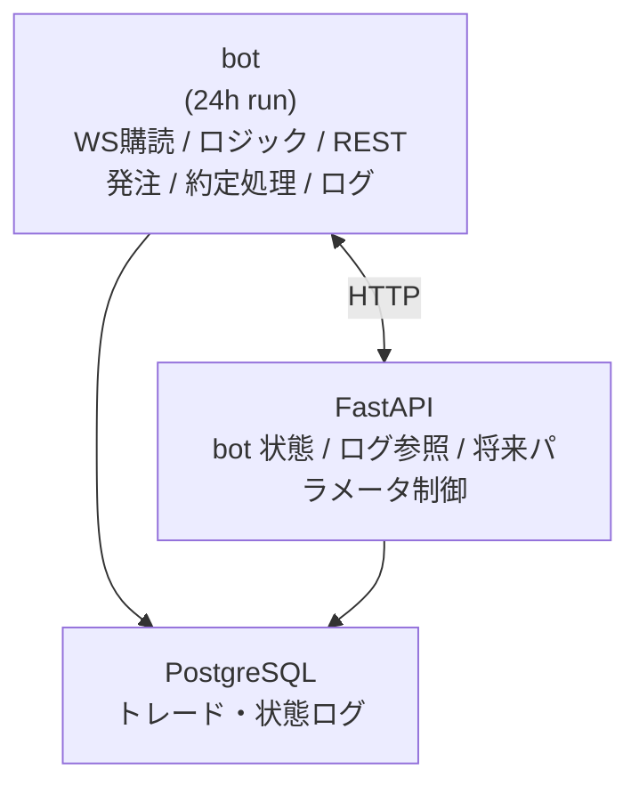

# alpha-market-engine

複数取引所・複数戦略に対応可能な、AI強化を前提にした暗号資産向け自動売買エンジン。
初期実装は **GMOコイン（現物）** を対象とし、
**WebSocket（リアルタイム購読）→ 戦略判定 → REST（発注）** の最小ループを提供する。

## Features
- ✅ 取引所 API を抽象化（将来的に複数取引所へ拡張）
- ✅ WebSocket によるリアルタイム購読（ticker / orderbooks / trades）
- ✅ REST による発注・取消・残高取得（HMAC認証）
- ✅ bot と管理API（FastAPI）を分離した安定運用構成
- ✅ AI/機械学習モデルの組み込みを想定した戦略レイヤ
- ✅ docker-compose で即起動できるテンプレート

## Architecture (High Level)



## Repository Structure

```

alpha-market-engine/
    docker-compose.yml
    .env
    bot/
        Dockerfile
        main.py
        exchange.py        # GMOコイン対応版
        strategy.py
        logger.py
        requirements.txt
    api/
        Dockerfile
        app.py
        routes.py
        requirements.txt
    shared/
        config.py
        db.py
    docs/
        要件.md
        アーキテクチャ.md
        実装ガイド.md
        bot設計.md
        FastAPI設計.md

```

## Setup

### 1. Create `.env`

```env
EXCHANGE=gmocoin
SYMBOL=BTC_JPY

API_KEY=your_api_key
API_SECRET=your_api_secret

TRADE_SIZE=0.001
LOG_LEVEL=INFO
```

**注意:** API キーに出金権限は付けない推奨。

### 2. Build & Run

```bash
docker-compose up --build
```

### 3. Health Check

* FastAPI: `http://localhost:8000/health`
* bot logs:

  ```bash
  docker logs -f trade_bot
  ```

## How It Works (Minimal Loop)

1. bot が Public WebSocket で ticker を購読
2. tick を `strategy.py` に渡してシグナル生成
3. BUY/SELL が出たら Private REST で発注
4. 約定/板/価格イベントを監視し、ログ保存
5. FastAPI で bot 状態やログを参照

## Strategy

`bot/strategy.py` は差し替え前提のレイヤ。
最初は単純ルールで動作確認し、後からAIへ置き換えるのが推奨。

### Example (Pseudo)

```python
def decide_signal(tick):
    # TODO: replace with ML/AI model
    if some_condition:
        return "BUY"
    if some_condition:
        return "SELL"
    return None
```

## Roadmap

* [ ] Strategy: MA cross / breakout / mean reversion
* [ ] AI Strategy: LightGBM / Transformer signals
* [ ] Multi Exchange: bitFlyer / Coincheck / overseas
* [ ] Risk controls: max drawdown, circuit breaker
* [ ] Backtesting module
* [ ] Dashboard UI

## Disclaimer

このリポジトリは学習・検証目的のテンプレートです。
実運用は自己責任で行ってください。
暗号資産は価格変動が大きく、損失が発生する可能性があります。