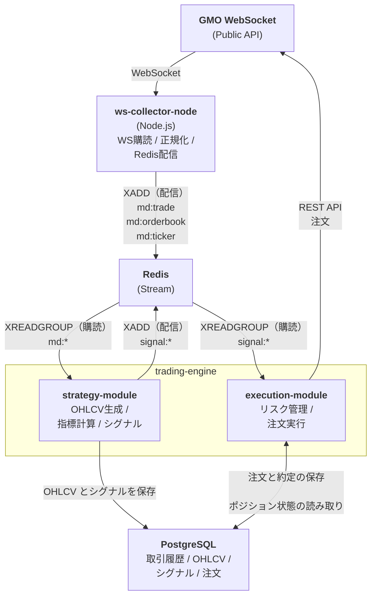

# システムアーキテクチャ

Node.js と Python のハイブリッド構成で、24/7 安定稼働する自動売買システムの設計。各サービスを分離し、Redis Stream を介してイベント駆動で動作する。

## 目次

1. [全体アーキテクチャ](#全体アーキテクチャ)
2. [技術スタック](#技術スタック)
3. [システム構成](#システム構成)
4. [Node/Python ハイブリッド構成](#nodepython-ハイブリッド構成)
5. [メッセージ設計](#メッセージ設計)

---

## 全体アーキテクチャ

### 基本方針

- **サービス分離**: 各サービスを独立したコンテナとして分離し、相互のクラッシュ影響を避ける
- **イベント駆動**: Redis Stream を介して、WebSocket データ収集 → 戦略評価 → 注文実行の流れを実現
- **言語の使い分け**: Node.js は I/O 処理（WebSocket、高頻度イベント）、Python は意思決定（指標計算、AI/ML）
- **データ永続化**: PostgreSQL で取引履歴、シグナル、OHLCV を永続化

### 最小構成



**Redis Stream を介した非同期通信を行う**

- ws-collector-node は Producer（配信）
- strategy-module は Consumer（購読）→ Producer（配信）
- execution-module は Consumer（購読）
- Redis Stream がメッセージキューとして機能

**strategy-module と execution-module の分離**

- **責務の分離**: Strategy はシグナル生成、Execution は注文実行に専念
- **独立したスケーリング**: 各モジュールを独立してスケール可能
- **障害の影響範囲を限定**: 一方のモジュールが停止しても他方に直接影響しない
- **エンティティクラスの共有**: 同じ DB スキーマを参照するため、`domain/models/` 配下でエンティティクラスを共有
- **キューワーカー的な動作**: 両方とも Redis Stream を購読してメッセージを処理するキューワーカーとして動作

この方式により、各サービスは独立して動作しています。

---

## 技術スタック

### 言語選択

- **Node.js**: WebSocket データ収集と正規化に専念（低遅延・高スループット・再接続に強い）
- **Python**: 戦略評価と注文実行に専念（指標計算/AI/ML の資産を最大化）

### 実行基盤

- Docker / docker-compose

### 取引所接続

- **Node.js**: 各取引所の WebSocket API に直接接続（板/約定/ティッカー）
- **Python**: ccxt または各取引所の REST API SDK（注文実行、残高照会）

### イベント駆動の骨格

- **Redis Stream**: 低遅延のイベントバス、Consumer Group で取りこぼしゼロ
- **Node.js**: 非同期 I/O で高頻度イベントを処理
- **Python**: asyncio で Redis Stream を購読し、シグナル生成・注文実行

---

## システム構成

### サービス構成（最小構成）

1. **ws-collector-node** (Node.js)
   - 取引所 WebSocket 接続（板/約定/ティッカー）
   - 正規化（取引所差異の吸収）
   - Redis Stream に配信（`md:trade`, `md:orderbook`, `md:ticker`）
   - 再接続・欠損検知

2. **strategy-module** (Python)
   - Redis Stream から市場データを購読（`md:trade`, `md:orderbook`, `md:ticker`）
   - OHLCV 生成（pandas/polars）
   - テクニカル指標計算（ta-lib / pandas-ta）
   - シグナル生成
   - Redis Stream にシグナル発行（`signal:*`）
   - PostgreSQL に OHLCV とシグナルを保存
   - **キューワーカーとして動作**: Redis Stream を購読してメッセージを処理

3. **execution-module** (Python)
   - Redis Stream からシグナルを購読（`signal:*`）
   - リスク管理・ポジション管理（DB から現在のポジションを取得）
   - REST API で注文発行（ccxt または取引所 SDK）
   - 約定/注文状態を監視して状態遷移
   - PostgreSQL に注文・約定履歴を保存
   - **キューワーカーとして動作**: Redis Stream を購読してメッセージを処理

**共通コンポーネント**:
   - エンティティクラス（モデル）の共有（`domain/models/`）
   - データベーススキーマの共有
   - ログ機能の共有

3. **redis**
   - 低遅延のイベントバス（Stream を使用）
   - Consumer Group で取りこぼしゼロ

4. **PostgreSQL**
   - 生データ、OHLCV、シグナル、注文/約定、PnL を永続化

### 通信フロー

1. **ws-collector-node ↔ GMO**: Public WebSocket（ticker/orderbooks/trades）
2. **ws-collector-node → Redis**: 正規化された市場データを Stream に配信（XADD）
3. **strategy-module ↔ Redis**: 市場データを購読（XREADGROUP）、シグナルを配信（XADD）
4. **execution-module ↔ Redis**: シグナルを購読（XREADGROUP）
5. **execution-module ↔ GMO**: Private REST API（order, cancel, assets）
6. **strategy-module → PostgreSQL**: OHLCV とシグナルを保存
7. **execution-module ↔ PostgreSQL**: 注文・約定履歴を保存、現在のポジション状態を取得（リスク管理用）

### データフロー

1. ws-collector-node が WebSocket で ticker/板/約定を購読
2. 正規化して Redis Stream（`md:*`）に配信
3. strategy-module が Redis Stream から購読（キューワーカーとして動作）
4. OHLCV 生成、指標計算、シグナル生成
5. シグナルを Redis Stream（`signal:*`）に配信
6. execution-module がシグナルを購読（キューワーカーとして動作）
7. リスク管理チェック（DB から現在のポジションを取得）
8. リスク管理後、REST API で注文発行
9. 約定イベントを REST API で監視し、DB に反映

### 信頼性・運用

- **再接続**: exponential backoff、heartbeat/ping 監視、スナップショット再取得
- **取りこぼしゼロ**: Redis Stream の Consumer Group で再開位置を保持
- **サービス分離**: 各サービスを独立したコンテナとして分離し、相互のクラッシュ影響を避ける
- **ログ**: stdout と DB の両方に出し、docker logs と DB 参照の両面で確認できるようにする

---

## Node/Python ハイブリッド構成

### 基本思想

- **Node 側は "市場データの受信と整形" に専念**: 低遅延・高スループット・再接続に強い
- **Python 側は "意思決定と注文" に専念**: 指標計算/検証/AIの資産を最大化

つまり「I/O工場」と「頭脳工場」を分離する設計。

### サービス構成（最小で強い形）

1. **ws-collector-node**
   - 取引所WS接続（板/約定/ティッカー）
   - 正規化（取引所差異の吸収）
   - Redis Stream / PubSub に配信
   - 重要：**再接続・欠損検知**

2. **trading-engine** (Python)
   - **Strategy モジュール**:
     - Redisから購読
     - OHLCV生成 / 指標計算
     - シグナル生成
     - Redis Stream にシグナル発行
   - **Execution モジュール**:
     - シグナル購読
     - リスク管理・ポジション管理（DB から現在のポジションを取得）
     - RESTで注文発行（ccxt or 取引所SDK）
     - 約定/注文状態を監視して状態遷移
   - **共通コンポーネント**:
     - エンティティクラス（モデル）の共有
     - データベーススキーマの共有

3. **db（Postgres/Timescale）**
   - 生データ、OHLCV、シグナル、注文/約定、PnL

4. **redis**
   - 低遅延のイベントバス
   - Stream を推奨（理由は後述）

### Redis Stream の採用理由

**PubSub**: 速いけど、落ちた瞬間にイベントが消える。

**Stream**:
- consumer groupで**再開位置を保持**
- **取りこぼしゼロ**
- 遅延や詰まりも見える

市場データは "落としたら負ける系" なので Stream が正解寄り。

### Node側の責務と実装ポイント

**1) 再接続の作法（絶対やる）**

- exponential backoff（例：1s,2s,4s... max30s）
- heartbeat/ping監視
- 接続復旧時は**スナップショット再取得**（板の整合性回復）

**2) 取引所差異の吸収レイヤ**

`adapter/{exchange}.ts` を切って統一I/Fへ。

```typescript
export interface NormalizedEvent {
  type: "trade" | "orderbook" | "ticker";
  exchange: string;
  symbol: string;
  ts: number;
  data: any;
}
```

**3) Redis Stream publish**

Stream名はシンプルに
- `md:trade`
- `md:orderbook`
- `md:ticker`

### Python側の責務と実装ポイント

**trading-engine（統合サービス）**

- **Strategy モジュール**:
  - Consumer Groupで `md:*` を購読
  - シンボルごとにOHLCVを生成（1s/1mなど）
  - テクニカル指標計算（ta-lib / pandas-ta）
  - 指標→シグナル
  - `signal:*` streamへ書き込み
- **Execution モジュール**:
  - `signal:*` 購読
  - **リスク判定→注文**（DB から現在のポジションを取得してチェック）
  - 注文後は REST で状態をポーリング or private WS があれば購読
  - 注文ステートマシン（NEW→PARTIALLY_FILLED→FILLED/CANCELED）
- **共通コンポーネント**:
  - エンティティクラス（Signal, Order, Position など）を共有
  - データベーススキーマを共有
  - ログ機能を共有

**初期実装（ルールベース）**

- 移動平均（MA）クロス
- RSI の閾値判定
- ボリンジャーバンドの上下タッチ
- 最初からAI前提にしない方が勝率が上がる → まずルールベースを動かしてデータ/パイプラインを固めるのが最短

**将来の発展（AI/ML）**

- **機械学習モデル**: scikit-learn（まずこれ）、PyTorch（深層学習やるなら）
  - リッジ回帰
  - LSTM（時系列モデル）
  - Transformer 系の埋め込み
- **LLM を使った戦略**:
  - 市場ニュースやソーシャルメディアの感情分析
  - マクロ経済指標の解釈と戦略への反映
  - 複数戦略の組み合わせ最適化
- **重要なポイント**:
  - 予測精度そのものより「どの市場状態で機能するか」が重要
  - モデル選びは環境選びと言える
  - バックテスト: pandasベース自作 or backtrader
  - イベント駆動シミュレータ: 実運用と同じループ構造で過去WS相当を流す → "本番との差分バグ"が激減する

**統合のメリット**

- エンティティクラスの共有が容易（同一プロセス内）
- 依存関係管理がシンプル
- 開発・デバッグが容易
- 初期段階では十分な分離（Strategy と Execution は独立したモジュールとして実装）

**将来の分離**

- 必要に応じて（スケーリング要件が異なる場合など）、Strategy と Execution を別サービスに分離可能
- その際も、エンティティクラスは共有パッケージとして分離して管理

### docker-compose

```yaml
ws-collector-node:
  build:
    context: ./services/ws-collector-node
    dockerfile: Dockerfile
  container_name: ws-collector-node
  restart: unless-stopped
  env_file:
    - ./services/ws-collector-node/env.example
  environment:
    EXCHANGE_NAME: ${EXCHANGE_NAME}
    WS_PUBLIC_URL: ${WS_PUBLIC_URL}
    SYMBOLS: ${SYMBOLS}
    REDIS_URL: ${REDIS_URL}
    LOG_LEVEL: ${LOG_LEVEL}
  depends_on:
    - redis
  networks:
    - bot-net

strategy-module:
  build:
    context: ./services/strategy_module
    dockerfile: Dockerfile
  container_name: strategy-module
  restart: unless-stopped
  env_file:
    - .env
  environment:
    SYMBOLS: ${SYMBOLS}
    REDIS_URL: redis://redis:6379/0
    DATABASE_URL: postgresql://bot:${POSTGRES_PASSWORD}@db:5432/${POSTGRES_DB}
    STRATEGY_NAME: ${STRATEGY_NAME}
    LOG_LEVEL: ${LOG_LEVEL}
  depends_on:
    - redis
    - db
  networks:
    - bot-net

execution-module:
  build:
    context: ./services/execution-module
    dockerfile: Dockerfile
  container_name: execution-module
  restart: unless-stopped
  env_file:
    - .env
  environment:
    SYMBOLS: ${SYMBOLS}
    REDIS_URL: redis://redis:6379/0
    DATABASE_URL: postgresql://bot:${POSTGRES_PASSWORD}@db:5432/${POSTGRES_DB}
    EXCHANGE_NAME: ${EXCHANGE_NAME}
    REST_BASE_URL: ${REST_BASE_URL}
    API_KEY: ${API_KEY}
    API_SECRET: ${API_SECRET}
    MAX_POSITION_SIZE: ${MAX_POSITION_SIZE}
    MAX_DRAWDOWN_PCT: ${MAX_DRAWDOWN_PCT}
    LOG_LEVEL: ${LOG_LEVEL}
  depends_on:
    - redis
    - db
  networks:
    - bot-net

redis:
  image: redis:7-alpine
  container_name: redis
  restart: unless-stopped
  networks:
    - bot-net
  volumes:
    - redis-data:/data
  command: ["redis-server", "--appendonly", "yes"]

db:
  image: postgres:15-alpine
  container_name: db
  restart: unless-stopped
  environment:
    POSTGRES_USER: bot
    POSTGRES_PASSWORD: ${POSTGRES_PASSWORD}
    POSTGRES_DB: ${POSTGRES_DB}
  networks:
    - bot-net
  volumes:
    - db-data:/var/lib/postgresql/data
```

### ディレクトリ構成

```
alpha-market-engine/
├── services/
│   ├── ws-collector-node/
│   │   ├── src/
│   │   │   ├── main.ts
│   │   │   ├── domain/
│   │   │   │   └── types.ts
│   │   │   ├── application/
│   │   │   │   ├── interfaces/
│   │   │   │   │   └── MarketDataAdapter.ts
│   │   │   │   └── handlers/
│   │   │   │       └── MessageHandler.ts
│   │   │   └── infrastructure/
│   │   │       ├── adapters/
│   │   │       │   └── gmo/
│   │   │       │       ├── GmoAdapter.ts
│   │   │       │       ├── GmoWebSocketClient.ts
│   │   │       │       ├── GmoMessageParser.ts
│   │   │       │       └── messages/
│   │   │       ├── redis/
│   │   │       │   └── RedisPublisher.ts
│   │   │       ├── reconnect/
│   │   │       │   ├── ReconnectManager.ts
│   │   │       │   └── BackoffStrategy.ts
│   │   │       └── websocket/
│   │   │           └── WebSocketConnection.ts
│   │   ├── Dockerfile
│   │   ├── package.json
│   │   ├── tsconfig.json
│   │   └── env.example
│   │
│   ├── shared/                       # 共有コード（strategy-module と execution-module で共有）
│   │   ├── domain/
│   │   │   └── models/               # 共有エンティティクラス
│   │   │       ├── __init__.py
│   │   │       ├── ohlcv.py         # OHLCV エンティティ（両方で使用）
│   │   │       ├── signal.py        # Signal エンティティ（両方で使用）
│   │   │       ├── order.py         # Order エンティティ（両方で使用）
│   │   │       ├── execution.py     # Execution エンティティ（両方で使用）
│   │   │       └── position.py      # Position エンティティ（両方で使用）
│   │   └── application/
│   │       └── interfaces/           # 共有リポジトリインターフェース
│   │           ├── __init__.py
│   │           ├── ohlcv_repository.py    # OHLCV リポジトリインターフェース（両方で使用）
│   │           └── signal_repository.py   # Signal リポジトリインターフェース（両方で使用）
│   │
│   ├── strategy_module/
│   │   ├── __init__.py
│   │   ├── config.py
│   │   ├── main.py
│   │   ├── domain/              # ドメイン層
│   │   │   ├── models/          # モジュール固有のエンティティクラス（現時点では空）
│   │   │   │   └── __init__.py
│   │   │   ├── entities/
│   │   │   └── value_objects/
│   │   ├── application/         # アプリケーション層
│   │   │   ├── usecases/        # ユースケース
│   │   │   │   └── strategy/    # Strategy ユースケース
│   │   │   │       ├── main.py
│   │   │   │       ├── ohlcv_generator.py
│   │   │   │       ├── indicator_calculator.py
│   │   │   │       └── signal_generator.py
│   │   │   ├── interfaces/      # インターフェース定義（モジュール固有のみ）
│   │   │   │   └── strategy.py  # Strategy インターフェース（モジュール固有）
│   │   │   │   # ohlcv_repository.py と signal_repository.py は shared/application/interfaces/ から共有
│   │   │   └── services/       # アプリケーションサービス
│   │   │       └── signal_publisher.py
│   │   └── infrastructure/      # インフラ層
│   │       ├── redis/           # Redis 接続
│   │       │   ├── consumer.py
│   │       │   └── publisher.py
│   │       ├── database/        # PostgreSQL 接続
│   │       │   ├── connection.py
│   │       │   ├── schema.py
│   │       │   └── repositories/
│   │       │       ├── ohlcv_repository.py
│   │       │       └── signal_repository.py
│   │       ├── strategies/      # 戦略実装
│   │       │   ├── base.py
│   │       │   └── moving_average_cross.py
│   │       └── logger/          # ログ実装
│   │           └── db_logger.py
│   │   ├── Dockerfile
│   │   ├── pyproject.toml
│   │   └── .env.example
│   │
│   └── execution-module/
│       ├── execution_engine/
│       │   ├── __init__.py
│       │   ├── config.py
│       │   ├── main.py
│       │   ├── domain/              # ドメイン層
│       │   │   ├── models/          # モジュール固有のエンティティクラス（現時点では空）
│   │   │   │   └── __init__.py
│       │   │   ├── entities/
│       │   │   └── value_objects/
│       │   ├── application/         # アプリケーション層
│       │   │   ├── usecases/        # ユースケース
│       │   │   │   └── execution/   # Execution ユースケース
│       │   │   │       ├── main.py
│       │   │   │       ├── risk_manager.py
│       │   │   │       └── order_executor.py
│       │   │   ├── interfaces/      # インターフェース定義
│       │   │   │   ├── order_repository.py
│       │   │   │   ├── position_repository.py
│       │   │   │   └── execution_repository.py
│       │   └── infrastructure/      # インフラ層
│       │       ├── redis/           # Redis 接続
│       │       │   └── consumer.py
│       │       ├── database/        # PostgreSQL 接続
│       │       │   ├── connection.py
│       │       │   ├── schema.py
│       │       │   └── repositories/
│       │       │       ├── order_repository.py
│       │       │       ├── position_repository.py
│       │       │       └── execution_repository.py
│       │       ├── broker/          # 取引所API連携
│       │       │   ├── gmo/
│       │       │   │   ├── client.py
│       │       │   │   └── order_executor.py
│       │       │   └── monitor.py
│       │       └── logger/          # ログ実装
│       │           └── db_logger.py
│       ├── Dockerfile
│       ├── pyproject.toml
│       └── .env.example
│
├── infra/
│   └── db/
│       └── init/
├── docker-compose.yml
├── docker-compose.local.yml
└── .env
```

### エンティティクラスの共有方法

strategy-module と execution-module で使用するエンティティクラス（`Signal`, `Order`, `Execution`, `Position`）は、`shared/domain/models/` 配下に配置し、両方のモジュールから参照します。

#### 共有エンティティの配置

**配置場所**: `shared/domain/models/`

**共有エンティティ**:
- `ohlcv.py`: OHLCV エンティティ（strategy-module で生成、execution-module で参照可能）
- `signal.py`: Signal エンティティ（strategy-module で生成、execution-module で消費）
- `order.py`: Order エンティティ（execution-module で生成・管理）
- `execution.py`: Execution エンティティ（execution-module で生成・管理）
- `position.py`: Position エンティティ（execution-module で管理、strategy-module で参照）

**モジュール固有エンティティ**:
- 現時点では、すべてのエンティティを `shared/` 配下で共有しています

#### 共有リポジトリインターフェースの配置

同じエンティティを扱うリポジトリインターフェースも `shared/application/interfaces/` 配下で共有します。

**配置場所**: `shared/application/interfaces/`

**共有インターフェース**:
- `ohlcv_repository.py`: OHLCV リポジトリインターフェース（両モジュールで使用）
- `signal_repository.py`: Signal リポジトリインターフェース（両モジュールで使用）

**モジュール固有インターフェース**:
- `strategy.py`: Strategy インターフェース（strategy-module のみ）
- `order_repository.py`: Order リポジトリインターフェース（execution-module のみ）
- `position_repository.py`: Position リポジトリインターフェース（execution-module のみ）
- `execution_repository.py`: Execution リポジトリインターフェース（execution-module のみ）

#### インポート方法

各モジュールから共有エンティティをインポートする際は、`PYTHONPATH` に `shared/` を追加するか、相対パスで参照します。

**例: strategy-module からのインポート**:
```python
# strategy_module/application/usecases/strategy/signal_generator.py
import sys
from pathlib import Path

# shared/ を PYTHONPATH に追加（開発環境）
shared_path = Path(__file__).parent.parent.parent.parent.parent / "shared"
sys.path.insert(0, str(shared_path))

from domain.models.signal import Signal
from domain.models.ohlcv import OHLCV  # 共有エンティティ
from application.interfaces.signal_repository import SignalRepository  # 共有インターフェース
from application.interfaces.ohlcv_repository import OhlcvRepository  # 共有インターフェース
```

**例: execution-module からのインポート**:
```python
# execution-module/execution_engine/application/usecases/execution/order_executor.py
import sys
from pathlib import Path

# shared/ を PYTHONPATH に追加（開発環境）
shared_path = Path(__file__).parent.parent.parent.parent.parent / "shared"
sys.path.insert(0, str(shared_path))

from domain.models.signal import Signal
from domain.models.order import Order
from application.interfaces.signal_repository import SignalRepository  # 共有インターフェース（必要に応じて）
```

#### Docker 環境での共有方法

Docker 環境では、`shared/` ディレクトリを各モジュールのコンテナにコピーまたはマウントします。

**方法1: Dockerfile で COPY（推奨）**:
```dockerfile
# strategy_module/Dockerfile
FROM python:3.11-slim

WORKDIR /app

# 共有エンティティをコピー
COPY ../shared/ /app/shared/

# モジュール固有のコードをコピー
COPY strategy_engine/ /app/strategy_engine/

# PYTHONPATH に shared/ を追加
ENV PYTHONPATH=/app:/app/shared

CMD ["python", "-m", "strategy_engine.main"]
```

**方法2: docker-compose で volume mount**:
```yaml
strategy-module:
  build:
    context: .
    dockerfile: services/strategy_module/Dockerfile
  volumes:
    - ./shared:/app/shared:ro  # 読み取り専用でマウント
  environment:
    PYTHONPATH: /app:/app/shared

execution-module:
  build:
    context: .
    dockerfile: services/execution-module/Dockerfile
  volumes:
    - ./shared:/app/shared:ro  # 読み取り専用でマウント
  environment:
    PYTHONPATH: /app:/app/shared
```

#### 運用上の注意点

1. **同期の重要性**: 共有エンティティを変更する際は、両方のモジュールで互換性を保つ必要があります
2. **変更時の影響範囲**: 共有エンティティの変更は、strategy-module と execution-module の両方に影響するため、慎重に検討します
3. **バージョン管理**: 共有エンティティの変更履歴は Git で管理し、変更理由を明確にします
4. **テスト**: 共有エンティティの変更時は、両方のモジュールのテストを実行します
5. **将来的な分離**: 必要に応じて、共有エンティティを独立した Python パッケージとして分離することも可能です

### この構成のメリット

- WS落ちても **取りこぼしゼロで復帰**
- 戦略はPython資産（pandas/AI/バックテスト）をそのまま流用
- WS負荷が上がっても Node 側を水平スケールしやすい
- 取引所追加が "adapter追加" で済む
- **エンティティクラスの一元管理**: 共有エンティティを `shared/` 配下で一元管理し、一貫性を保つ

---

## メッセージ設計

### 正規化イベント（Node → Redis）

取引所ごとに形式が違うので、必ず共通フォーマットにする。

**trade イベント**:
```json
{
  "type": "trade",
  "exchange": "gmo",
  "symbol": "BTC_JPY",
  "ts": 1732312345123,
  "data": {
    "price": 6123456,
    "size": 0.01,
    "side": "buy"
  }
}
```

**orderbook イベント**:
```json
{
  "type": "orderbook",
  "exchange": "gmo",
  "symbol": "BTC_JPY",
  "ts": 1732312345123,
  "data": {
    "is_snapshot": false,
    "bids": [[6123000, 0.5], [6122000, 0.8]],
    "asks": [[6124000, 0.4], [6125000, 1.2]],
    "checksum": "...."
  }
}
```

### シグナル（Python Strategy → Redis）

```json
{
  "type": "signal",
  "exchange": "gmo",
  "symbol": "BTC_JPY",
  "ts": 1732312345999,
  "strategy": "breakout_v1",
  "action": "enter_long",
  "confidence": 0.72,
  "price_ref": 6123500,
  "meta": {
    "reason": "donchian_break",
    "lookback": 20
  }
}
```

**action の種類**:
- `enter_long`: ロングエントリー
- `exit`: ポジション解消
- `enter_short`: ショートエントリー
- `hold`: 現状維持

### 注文（Execution → DB/ログ）

Executionは Redisに「注文イベント」も出すと観測性が上がる。

---

## 参考資料

- [GMOコイン API Documentation](https://api.coin.z.com/docs/)
- [ws-collector-node 設計](./02_ws_collector_node.md)
- [strategy-module 設計](./03_strategy_archi.md)
- [execution-module 設計](./04_execution_archi.md)
- [コード規約](../coding_standards.md)

