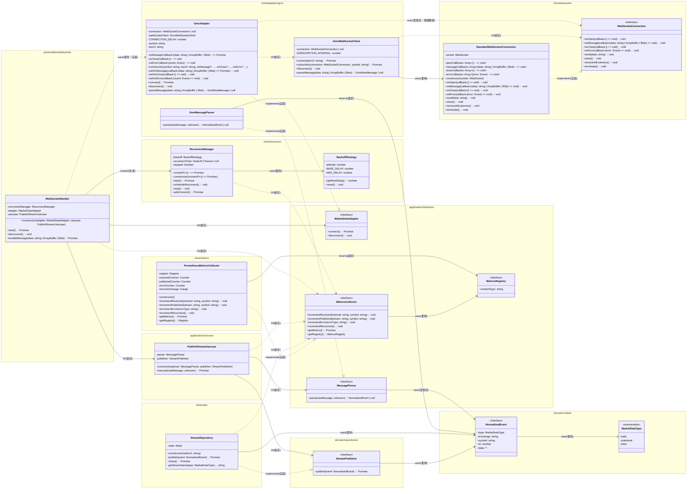

# collector 設計

Node.js で実装する WebSocket データコレクター。取引所の WebSocket API からリアルタイムで市場データ（ticker/orderbook/trade）を取得し、正規化して Redis Stream に配信する。

## 目次

1. [責務と基本方針](#責務と基本方針)
2. [技術スタック](#技術スタック)
3. [アーキテクチャ](#アーキテクチャ)
4. [コンポーネント設計](#コンポーネント設計)
5. [再接続・エラーハンドリング](#再接続エラーハンドリング)
6. [メッセージ正規化](#メッセージ正規化)
7. [Redis Stream への配信](#redis-stream-への配信)
8. [プロジェクト構成](#プロジェクト構成)
9. [参考資料](#参考資料)

---

## 責務と基本方針

### 責務

collector は以下の責務を持つ:

- **WebSocket 接続管理**: 取引所の Public WebSocket API に接続し、ticker/orderbook/trade を購読
- **データ正規化**: 取引所ごとに異なるメッセージ形式を統一フォーマットに変換
- **Redis Stream 配信**: 正規化されたデータを Redis Stream に配信
- **再接続・欠損検知**: 接続切断時の自動再接続とデータ欠損の検知・通知

### 基本方針

- **低遅延・高スループット**: Node.js の非同期処理を活用し、高頻度のイベントを処理
- **堅牢性**: 再接続、エラーハンドリング、データ整合性を重視
- **拡張性**: 取引所追加が容易なアダプターパターンを採用
- **観測性**: ログとメトリクスで動作状況を可視化

---

## 技術スタック

### Node.js

- **Node.js v24 以上（LTS）**: フラグなしで WebSocket が使える（ブラウザと同様の API）
- **TypeScript**: 型安全性と開発体験の向上

### WebSocket ライブラリ

- **Node.js 標準 WebSocket**: クライアント接続用（Node.js v22+）
- **ws パッケージ**: サーバー用途や追加機能が必要な場合（今回は使用しない）

### Redis クライアント

- **ioredis**: Redis Stream の操作に最適

### ログライブラリ

- **pino**: 構造化ログ（JSON形式）
  - 非同期I/Oで高速
  - 開発環境では `pino-pretty` を使用して人間可読形式で出力
  - 本番環境では JSON 形式で出力
  - 環境変数 `LOG_LEVEL` でログレベルを制御（debug, info, warn, error）

### その他

- **dotenv**: 環境変数管理
- **zod**: ランタイム型検証

---

## アーキテクチャ

### 全体構成


### データフロー

1. **接続確立**: GMO コインの Public WebSocket API に接続
2. **購読**: ticker/orderbook/trade チャンネルを購読
3. **受信**: WebSocket からメッセージを受信
4. **正規化**: 取引所固有の形式を統一フォーマットに変換
5. **配信**: Redis Stream に正規化されたデータを配信
6. **再接続**: 切断時は自動再接続とスナップショット再取得

---

## コンポーネント設計

### クラス図




### ディレクトリ構成
```
collector/
└── src/
    ├── main.ts
    ├── presentation/ (外部からの入力口)
    │   └── websocket/
    │       └── WebSocketHandler.ts      (WS接続の維持・メッセージ受信・再接続管理)
    ├── application/  (ビジネスプロセスの制御)
    │   ├── interfaces/
    │   │   ├── Logger.ts                 (ロガーインターフェース)
    │   │   ├── MarketDataAdapter.ts      (取引所アダプタのインターフェース)
    │   │   └── MessageParser.ts          (メッセージパーサーのインターフェース)
    │   └── usecases/
    │       └── PublishStreamUsecase.ts   (受信データを検証しStreamへ投げる司令塔)
    ├── domain/       (業務ルールとインターフェース)
    │   ├── models/           (扱うデータの型・値オブジェクト)
    │   │   └── NormalizedEvent.ts        (正規化されたイベントの型定義)
    │   └── repositories/
    │       └── StreamPublisher.ts        (Redis等への保存口となるインターフェース)
    └── infra/        (具体的な技術実装)
        ├── adapters/
        │   └── gmo/
        │       ├── GmoAdapter.ts         (GMO取引所のアダプタ実装)
        │       ├── GmoMessageParser.ts   (GMOメッセージのパーサー)
        │       ├── GmoWebSocketClient.ts (GMO WebSocket接続・購読)
        │       └── types/
        │           ├── GmoCommand.ts     (GMOコマンドの型定義)
        │           └── GmoRawMessage.ts  (GMO生メッセージの型定義)
        ├── logger/
        │   ├── LoggerFactory.ts          (ロガーファクトリー・シングルトン管理)
        │   └── PinoLogger.ts             (pino実装・構造化ログ出力)
        ├── reconnect/
        │   ├── ReconnectManager.ts       (再接続管理)
        │   └── BackoffStrategy.ts        (指数バックオフ戦略)
        ├── redis/
        │   └── StreamRepository.ts       (Redis StreamへのXADD等の実処理)
        └── websocket/
            ├── interfaces/
            │   └── WebSocketConnection.ts (WebSocket接続のインターフェース)
            └── StandardWebSocketConnection.ts (標準WebSocket接続の実装)
```

### 各層の役割とデータの流れ

- **Presentation層 (`presentation/websocket/WebSocketHandler`)**
  - 外部（取引所API）からのWebSocket接続を受け取ります
  - 接続の維持・再接続管理を担当します
  - 受信した「生データ」をApplication層のUseCaseに委譲します
  - `MarketDataAdapter` を使用して取引所固有の接続を管理します

- **Application層 (`application/usecases/PublishStreamUsecase`)**
  - 「受信したデータをどのStreamに流すか」という手順（シナリオ）を記述します
  - `MessageParser` を使用して生データを正規化し、`StreamPublisher` インターフェースを通じて配信します
  - ここにはRedisの具体的なコードは書かず、Domain層で定義されたインターフェース（Repository等）を通じて処理を依頼します

- **Domain層**
  - **`domain/models/NormalizedEvent`**: データのバリデーションルールや、ビジネス上の意味を持つデータ構造を定義します
  - **`domain/repositories/StreamPublisher`**: 「抽象的なインターフェース」を定義し、具体的な技術（Redis）に依存させないのがDDDの肝です

- **Infrastructure層 (`infra/`)**
  - **`infra/redis/StreamRepository`**: Redis クライアント（ ioredis 等）を使用して、実際に XADD などのコマンドを実行して Redis Stream へデータを流し込みます
  - **`infra/adapters/gmo/`**: GMO取引所固有のWebSocketプロトコル実装（接続、購読、メッセージパース）
  - **`infra/reconnect/`**: 再接続管理と指数バックオフ戦略の実装
  - **`infra/websocket/`**: WebSocket接続の抽象化と標準実装

### この構成のメリット

**交換可能性:**
将来的にRedis StreamではなくKafkaやRabbitMQに変更したくなった場合、infra/ の中身を書き換えるだけで済み、ビジネスロジック（Domain/Application）を修正する必要がありません。

**テストのしやすさ:**
Application層のテストにおいて、Redisの実機を使わずに「モック（偽物のPublisher）」を注入してロジックの検証が可能です。

**スケール対応:**
Redis Streamを介在させることで、WebSocketサーバーが複数台にスケールしても、後続のコンシューマーが一貫してデータを処理できる構成になります。

### main.ts

取引所の銘柄ごとに WS 接続を開始する。
SIGINT 命令、SIGTERM 命令を受け取ると WS 接続を終了する。

WS 接続は、WebSocketHandler で以下の責務を負う
- WS 接続の開始
- 受信メッセージを stream に流す
- 接続の維持 (再接続)、切断

エントリーポイント。依存関係の注入とコンポーネントの初期化を担当します。
- `PublishStreamUsecase` を生成
- `GmoAdapter` と `WebSocketHandler` を生成
- シグナルハンドリング（SIGINT/SIGTERM）でクリーンアップ

### presentation/websocket/WebSocketHandler.ts

WebSocket接続の維持・メッセージ受信・再接続管理を担当します。
- `MarketDataAdapter` を使用して接続を管理
- `ReconnectManager` を使用して再接続を管理
- メッセージを `PublishStreamUsecase` に委譲

### application/usecases/PublishStreamUsecase.ts

受信データを検証し、Streamへ配信する司令塔です。
- `MessageParser` を使用して生データを正規化
- `StreamPublisher` インターフェースを通じて配信

### domain/models/NormalizedEvent.ts

正規化されたマーケットデータイベントの型定義です。
- `MarketDataType`: マーケットデータ種別（'trade' | 'orderbook' | 'ticker'）
- `NormalizedEvent<T>`: 正規化されたイベントのインターフェース

### domain/repositories/StreamPublisher.ts

ストリームパブリッシャーのインターフェースです。
- `publish(event: NormalizedEvent): Promise<void>` メソッドを定義
- インフラ層で実装される（`StreamRepository`）

### infra/redis/StreamRepository.ts

Redis Stream への書き込み実装です。
- `StreamPublisher` インターフェースを実装
- ioredis を使用して XADD コマンドを実行

### infra/adapters/gmo/GmoAdapter.ts

GMO コインの WebSocket API を処理するアダプターです。
- `MarketDataAdapter` インターフェースを実装
- 取引所固有のWebSocketプロトコル実装（接続、購読、メッセージパース）

### infra/adapters/gmo/GmoMessageParser.ts

GMO コインのメッセージを正規化するパーサーです。
- `MessageParser` インターフェースを実装
- GMO固有のメッセージ形式を `NormalizedEvent` に変換

### infra/reconnect/ReconnectManager.ts

再接続ロジックを管理します。
- 指数バックオフ戦略を使用
- 接続失敗時に自動的に再接続をスケジュール

### infra/reconnect/BackoffStrategy.ts

指数バックオフ戦略の実装です。

```typescript
export class BackoffStrategy {
  private attempt = 0;
  private readonly baseDelay = 1000; // 1秒
  private readonly maxDelay = 30000; // 30秒

  getNextDelay(): number {
    const delay = Math.min(
      this.baseDelay * Math.pow(2, this.attempt),
      this.maxDelay
    );
    this.attempt++;
    return delay;
  }

  reset(): void {
    this.attempt = 0;
  }
}
```

---

## 再接続・エラーハンドリング

### 再接続戦略

**方針**:
- 指数バックオフ（1s, 2s, 4s... max 30s）
- 接続復旧時はスナップショット再取得（板の整合性回復）
- heartbeat/ping 監視で接続状態を確認

**実装ポイント**:
- WebSocket の `close` イベントで再接続をスケジュール
- 接続成功時にバックオフをリセット
- 最大リトライ回数は設定可能（デフォルト: 無制限）

### エラーハンドリング

**想定されるエラー**:
- ネットワーク切断
- WebSocket プロトコルエラー
- メッセージパースエラー
- Redis 接続エラー

**対応方針**:
- すべてのエラーをログに記録
- 致命的でないエラーは再接続で回復を試みる
- Redis エラーはリトライ（指数バックオフ）

---

## レート制限対策

### GMO コイン API のレート制限

GMO コインの Public WebSocket API には、リクエスト頻度に関する制限があります。詳細は [GMO コイン API ドキュメント](https://api.coin.z.com/docs/#outline) の「制限」セクションを参照してください。

**主な制限事項**:
- **Public WebSocket API**: 購読リクエストの送信頻度に制限があります
- **エラーコード ERR-5003**: "Request too many." が返された場合、レート制限に達しています

### 現在の実装での対策

collector では、以下の対策を実装しています：

**接続確立後の待機時間**

1. WebSocket 接続確立
2. **1000ms**（1秒） (`CONNECTION_DELAY`)
3. ticker チャンネル購読
4. **2000ms**（2秒） (`SUBSCRIPTION_INTERVAL`)
5. orderbooks チャンネル購読
6. **2000ms**（2秒） (`SUBSCRIPTION_INTERVAL`)
7. trades チャンネル購読

**合計時間**: 約 5秒（接続確立後）

### メトリクスによる監視

ERR-5003 エラーの発生頻度をメトリクスで監視し、レート制限対策の効果を確認します：

```typescript
// WebSocketHandler.ts
if (errorMsg.includes('ERR-5003')) {
  this.logger.warn('Rate limit error detected. Consider increasing subscription interval.', {
    error: errorMsg,
  });

  // メトリクス収集: API エラー
  if (this.metricsCollector) {
    this.metricsCollector.incrementError('api_error');
  }
}
```

**Prometheus メトリクス**:
- `collector_errors_total{error_type="api_error"}`: API エラー数の推移を監視
- ERR-5003 エラーが継続的に発生する場合は、設定値の見直しが必要です

### 参考資料

- [GMO コイン API ドキュメント](https://api.coin.z.com/docs/#outline)
- [GMO コイン API エラーコード一覧](https://api.coin.z.com/docs/#エラーコード)

---

## メッセージ正規化

### 正規化インターフェース

```typescript
export interface NormalizedEvent {
  type: 'trade' | 'orderbook' | 'ticker';
  exchange: string;
  symbol: string;
  ts: number; // ミリ秒エポック
  data: any;
}
```

### GMO コインの正規化例

**ticker メッセージ**:
```typescript
// GMO コインの形式
{
  "channel": "ticker",
  "symbol": "BTC_JPY",
  "timestamp": "2024-01-01T00:00:00.000Z",
  "last": 6123456,
  "bid": 6123000,
  "ask": 6124000,
  "volume": 123.45
}

// 正規化後
{
  type: "ticker",
  exchange: "gmo",
  symbol: "BTC_JPY",
  ts: 1704067200000,
  data: {
    last: 6123456,
    bid: 6123000,
    ask: 6124000,
    volume: 123.45
  }
}
```

**orderbook メッセージ**:
```typescript
// GMO コインの形式
{
  "channel": "orderbooks",
  "symbol": "BTC_JPY",
  "timestamp": "2024-01-01T00:00:00.000Z",
  "bids": [[6123000, 0.5], [6122000, 0.8]],
  "asks": [[6124000, 0.4], [6125000, 1.2]]
}

// 正規化後
{
  type: "orderbook",
  exchange: "gmo",
  symbol: "BTC_JPY",
  ts: 1704067200000,
  data: {
    is_snapshot: false, // 差分かスナップショットか
    bids: [[6123000, 0.5], [6122000, 0.8]],
    asks: [[6124000, 0.4], [6125000, 1.2]]
  }
}
```

**trade メッセージ**:
```typescript
// GMO コインの形式
{
  "channel": "trades",
  "symbol": "BTC_JPY",
  "timestamp": "2024-01-01T00:00:00.000Z",
  "price": 6123456,
  "size": 0.01,
  "side": "BUY"
}

// 正規化後
{
  type: "trade",
  exchange: "gmo",
  symbol: "BTC_JPY",
  ts: 1704067200000,
  data: {
    price: 6123456,
    size: 0.01,
    side: "buy" // 統一（小文字）
  }
}
```

---

## Redis Stream への配信

### Stream 名の規則

- `md:trade`: 約定情報
- `md:orderbook`: 板情報
- `md:ticker`: 最新レート

### メッセージ形式

Redis Stream の各エントリは以下の形式:

```
{
  "exchange": "gmo",
  "symbol": "BTC_JPY",
  "ts": "1704067200000",
  "data": "{\"price\":6123456,\"size\":0.01,\"side\":\"buy\"}"
}
```

### 配信の最適化

- **バッチ処理**: 複数メッセージをまとめて配信（オプション）
- **圧縮**: 大きなメッセージ（orderbook など）は圧縮を検討
- **優先度**: ticker を最優先で配信

---

## ロガー設計

### 参考
- [Node.jsロギングツールの詳細な分析と比較](https://leapcell.io/blog/ja/nodejs-rogingu-turu-no-details-na-bunseki-to-hikaku)

### 概要

collector サービスでは **pino** を使用した構造化ログを採用しています。
また、テスト時にモックを注入しやすいように各コンポーネントに logger インスタンスを注入している。

pino が担うべき役割として、何が起きたかを証拠として残す
- いつ接続したか
- なぜ接続が切れたか
- どこで詰まったか
これを JSON で時系列に残す。

### 特徴

- **爆速JSONログ**: 
- **構造化ログ（JSON形式）**: メタデータを構造化して検索・集計しやすい
- **ログレベル制御**: 環境変数 `LOG_LEVEL` で制御（debug, info, warn, error）
- **子ロガー（Child Logger）**: コンポーネントごとにコンテキスト（component, symbol など）を自動付与
- **環境別出力**: 開発環境では人間可読形式、本番環境では JSON 形式
- 非同期I/Oで高速（特に本番環境）
- メッセージのシリアライズが効率的

本プロジェクトでは、
1. リアルタイム取引システムではログの可観測性が重要
2. 複数シンボル・複数取引所対応時に構造化ログが有効
3. 本番環境でのパフォーマンス向上
4. ログ集約ツールとの連携が容易
により採用を確定した。

### ロガーインターフェース

```typescript
export interface Logger {
  debug(msg: string, meta?: object): void;
  info(msg: string, meta?: object): void;
  warn(msg: string, meta?: object): void;
  error(msg: string, meta?: object): void;
  child(bindings: object): Logger;
}
```

### 使用例

```typescript
// ルートロガーの作成
const rootLogger = LoggerFactory.create();

// 子ロガーの作成（コンテキストを自動付与）
const adapterLogger = rootLogger.child({ component: 'GmoAdapter', symbol: 'BTC_JPY' });

// ログ出力
adapterLogger.info('subscribed to channel', { channel: 'ticker' });
adapterLogger.error('socket error', { err: error, event });
```

### 環境変数

- `LOG_LEVEL`: ログレベル（debug, info, warn, error）。デフォルトは `info`
- `NODE_ENV`: 環境（production の場合は JSON 形式、それ以外は pretty 形式）

### ログ出力例

**開発環境（pretty形式）**:
```
[2024-01-01 12:00:00.000] INFO (GmoAdapter/BTC_JPY): subscribed to channel
    channel: "ticker"
```

**本番環境（JSON形式）**:
```json
{"level":30,"time":1704067200000,"component":"GmoAdapter","symbol":"BTC_JPY","channel":"ticker","msg":"subscribed to channel"}
```
### ログ出力ファイルについて

```typescript:services/collector/src/infra/logger/PinoLogger.ts
// 現在の実装
this.pinoLogger = pino({
  level,
  // destination が指定されていない = デフォルトで stdout に出力
});
```

現在は:
- 開発環境: `pino-pretty` で `stdout` に出力
- 本番環境: JSON形式で `stdout` に出力
- ファイル出力: 未実装

#### Docker環境での動作

Dockerコンテナで実行する場合:
- `stdout` への出力は `docker logs` で確認可能
- ログローテーションは Docker のログドライバーで管理可能

#### ファイル出力が必要な場合の実装案

ファイル出力が必要なら、以下のように実装できます：

```typescript
// PinoLogger.ts の修正案
constructor(options?: { level?: string; pretty?: boolean; destination?: string }) {
  const level = options?.level ?? process.env.LOG_LEVEL ?? 'info';
  const isDevelopment = process.env.NODE_ENV !== 'production';
  const usePretty = options?.pretty ?? isDevelopment;
  const destination = options?.destination ?? process.env.LOG_FILE;

  const pinoOptions: pino.LoggerOptions = {
    level,
  };

  if (destination) {
    // ファイル出力を指定
    const destinationStream = pino.destination(destination);
    this.pinoLogger = pino(pinoOptions, destinationStream);
  } else if (usePretty) {
    // 開発環境: pino-pretty を使用
    this.pinoLogger = pino({
      ...pinoOptions,
      transport: {
        target: 'pino-pretty',
        options: {
          colorize: true,
          translateTime: 'HH:MM:ss.l',
          ignore: 'pid,hostname',
        },
      },
    });
  } else {
    // 本番環境: JSON 形式で stdout に出力
    this.pinoLogger = pino(pinoOptions);
  }
}
```

環境変数例:
```bash
LOG_FILE=/var/log/collector/app.log  # ファイル出力を指定
```

#### 推奨事項

Docker環境では:
- `stdout` への出力で十分（`docker logs` で確認可能）
- ログローテーションは Docker のログドライバーで管理
- ファイル出力が必要な場合のみ実装を追加

現時点ではファイル出力の実装は不要と判断できますが、必要に応じて上記の実装を追加できます。

---
## メトリクス集計設計

メトリクス… システムの状態、性能、ビジネスの成果などを客観的に把握・評価するために数値化した指標

### 計測対象メトリクス

観測して指標を作っていく要素を必須、拡張として考えていきます。

#### 必須メトリクス

|メトリクス|説明|
|---|---|
|受信メッセージ数|WebSocket API から受信したメッセージ数（チャンネル別、シンボル別）|
|配信メッセージ数|Redis Stream に配信したメッセージ数（ストリーム別、シンボル別）|
|エラー数|パースエラー、配信エラー、API エラー（種類別）|
|再接続回数|WebSocket 切断・再接続の回数|

#### 拡張メトリクス

|メトリクス|説明|
|---|---|
|レイテンシー|受信から配信までの時間（p50, p95, p99）|
|メッセージサイズ|受信/配信メッセージの平均サイズ|
|バッファサイズ|Redis 接続のバッファ状態|


### 開発
ローカル環境: Docker イメージに prometheus と grafana があるのでそれを利用
実行環境: クラウドサービス(AWS の Prometheus、Grafana を利用、または CloudWatch を検討)


#### prom-client

Node.js 用の Prometheus クライアントライブラリ。
collector サービス内でメトリクスを収集・公開する役割。

1. メトリクスの収集（カウンター、ゲージ、ヒストグラムなど）
2. メモリ内での保持
3. HTTP エンドポイント（/metrics）での公開


- **prom-client**
  - Counter, Gauge, Histogram など
  - メモリ内でカウンターを保持

- **HTTP サーバー（Node.js 標準）**
  - GET /metrics → prom-client から
  - メトリクスを取得して返す

### Grafana（観測結果の表示）

Grafana の役割は
1. Prometheus から時系列データをクエリ（PromQL）
2. ダッシュボードで可視化
3. アラート設定（オプション）

#### Grafana の構成要素
- **PromQL クエリエンジン**
  - Prometheus の時系列DBに PromQL でクエリ
  - 例: rate(collector_messages_received_total[1m])
- **ダッシュボード（可視化）**
  - グラフ、テーブル、ゲージなどで表示
  - リアルタイム更新

#### Grafana へのアクセス

**ローカル環境でのアクセス方法**:

1. **Grafana にアクセス**
   - URL: `http://localhost:3000`
   - ユーザー名: `admin`
   - パスワード: `admin`

2. **データソースの確認**
   - 左メニューから「Configuration」→「Data sources」を選択
   - 「Prometheus」データソースが自動設定されていることを確認
   - 「Save & test」で接続確認

3. **ダッシュボードの確認**
   - 左メニューから「Dashboards」→「Browse」を選択
   - "Collector Metrics Dashboard" が表示される
   - クリックして各パネルのメトリクスを確認

#### プロビジョニング設定

Grafana は起動時に自動的にデータソースとダッシュボードを読み込みます。

**データソースのプロビジョニング**:
- ファイル: `grafana/provisioning/datasources/prometheus.yml`
- Prometheus データソースを自動設定
- URL: `http://prometheus:9090`

**ダッシュボードのプロビジョニング**:
- ファイル: `grafana/provisioning/dashboards/dashboards.yml`
- ダッシュボード JSON ファイルを自動読み込み
- パス: `/etc/grafana/provisioning/dashboards`
- 更新間隔: 10秒

#### Collector Metrics Dashboard

**ダッシュボード構成**:

1. **受信メッセージ数の推移（チャンネル別）**
   - タイプ: Time series
   - クエリ: `sum by (channel) (rate(collector_messages_received_total[1m]))`
   - 説明: WebSocket から受信したメッセージ数をチャンネル（ticker, orderbooks, trades）別に表示

2. **配信メッセージ数の推移（ストリーム別）**
   - タイプ: Time series
   - クエリ: `sum by (stream) (rate(collector_messages_published_total[1m]))`
   - 説明: Redis Stream に配信したメッセージ数をストリーム（md:ticker, md:orderbook, md:trade）別に表示

3. **エラー発生状況**
   - タイプ: Time series
   - クエリ: `sum by (error_type) (rate(collector_errors_total[5m]))`
   - 説明: エラータイプ（api_error, parse_error, publish_error）別のエラー発生率

4. **再接続回数**
   - タイプ: Stat
   - クエリ: `collector_reconnects_total`
   - 説明: 累計再接続回数

5. **総受信メッセージ数**
   - タイプ: Stat
   - クエリ: `sum(collector_messages_received_total)`
   - 説明: 全チャンネルの累計受信メッセージ数

6. **メッセージ処理状況（テーブル）**
   - タイプ: Table
   - クエリ: `collector_messages_received_total` と `collector_messages_published_total`
   - 説明: チャンネル/ストリーム別の累計メッセージ数をテーブル形式で表示

**ダッシュボード設定**:
- **UID**: `collector-metrics`
- **タイトル**: "Collector Metrics Dashboard"
- **リフレッシュ間隔**: 15秒（Prometheus の scrape_interval に合わせる）
- **デフォルト時間範囲**: 直近1時間

#### よく使用する PromQL クエリ例

**受信メッセージ数の推移（チャンネル別）**:
```promql
sum by (channel) (rate(collector_messages_received_total[1m]))
```

**配信メッセージ数の推移（ストリーム別）**:
```promql
sum by (stream) (rate(collector_messages_published_total[1m]))
```

**エラー発生率**:
```promql
sum by (error_type) (rate(collector_errors_total[5m]))
```

**再接続回数**:
```promql
collector_reconnects_total
```

**チャンネル別の受信数**:
```promql
sum by (channel) (collector_messages_received_total)
```

**ストリーム別の配信数**:
```promql
sum by (stream) (collector_messages_published_total)
```

#### ダッシュボードのカスタマイズ

Grafana のダッシュボードは編集可能です（`allowUiUpdates: true` の設定により）。

**カスタマイズ方法**:
1. ダッシュボードを開く
2. 右上の「⚙️」アイコン（設定）をクリック
3. 「Add panel」で新しいパネルを追加
4. 既存のパネルを編集する場合は、パネルタイトルをクリック → 「Edit」を選択

**注意**: プロビジョニングされたダッシュボードは、コンテナ再起動時に JSON ファイルの内容で上書きされる可能性があります。永続的な変更を加える場合は、`grafana/provisioning/dashboards/collector-metrics.json` を編集してください。


---

## 参考資料

- [Node.js v22 WebSocket](https://nodejs.org/en/blog/announcements/v22-release-announce#websocket) - Node.js v22 でフラグなしで使える WebSocket
- [Node.js と ws でシンプルな WebSocketサーバー](https://qiita.com/youtoy/items/9e1eeae728dc98f15679) - WebSocket の実装例
- [GMOコイン API Documentation](https://api.coin.z.com/docs/#t-spot_param_list_symbol) - GMO コインの WebSocket API
- [システムアーキテクチャ](./01_architecture.md) - システム全体のアーキテクチャ
- [レイヤードアーキテクチャを採用した際のWebSocket実装例](https://blog.p1ass.com/posts/websocket-with-layerd-architecture/#:~:text=%E6%98%8E%E7%A2%BA%E3%81%AB%20DDD%20%E3%82%84%20Clean%20Architecture%20%E3%81%A7%E3%81%82%E3%82%8B%E3%81%A8%E3%81%AF%E8%A8%80%E3%81%88%E3%81%AA%E3%81%84%E3%81%A7%E3%81%99%E3%81%8C%E3%80%81%E3%81%9D%E3%81%AE%E6%80%9D%E6%83%B3%E3%82%92%E5%8F%96%E3%82%8A%E5%85%A5%E3%82%8C%E3%81%A4%E3%81%A4%E7%8B%AC%E8%87%AA%E3%81%AB%E3%82%AB%E3%82%B9%E3%82%BF%E3%83%9E%E3%82%A4%E3%82%BA%E3%81%97%E3%81%A6%E3%81%84%E3%81%BE%E3%81%99%E3%80%82%5B%5E1%5D.%20%5B%5E1%5D%20%E3%81%93%E3%81%93%E3%81%A7%E3%81%AF%E3%81%93%E3%81%AE%E3%82%A2%E3%83%BC%E3%82%AD%E3%83%86%E3%82%AF%E3%83%81%E3%83%A3%E3%81%AE%E8%89%AF%E3%81%97%E6%82%AA%E3%81%97%E3%81%AB%E3%81%A4%E3%81%84%E3%81%A6%E3%81%AF%E8%AA%9E%E3%82%8A%E3%81%BE%E3%81%9B%E3%82%93%E3%80%82%E8%A9%B1%E3%81%8C%E9%80%B8%E3%82%8C%E3%81%99%E3%81%8E%E3%82%8B%E3%81%AE%E3%81%A7%E3%80%82%20WebSocket%20%E3%81%AE%E6%A9%9F%E8%83%BD%E8%A6%81%E4%BB%B6)
- [prom-client](https://github.com/siimon/prom-client)
