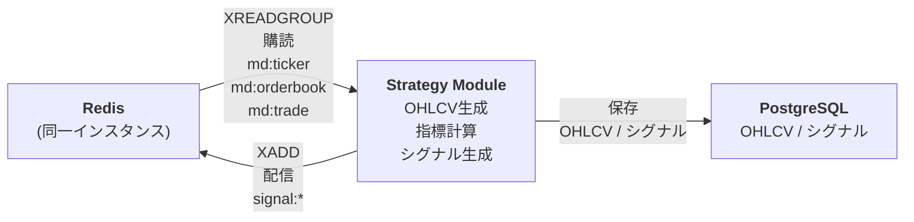

# Strategy Module アーキテクチャ

strategy-module の設計と実装方針。Redis Stream から市場データを購読し、OHLCV 生成、テクニカル指標計算、シグナル生成を行う。キューワーカーとして動作し、生成したシグナルを Redis Stream に配信する。

## 目次

1. [責務と基本方針](#責務と基本方針)
2. [データフロー](#データフロー)
3. [コンポーネント設計](#コンポーネント設計)
4. [戦略の実装](#戦略の実装)
5. [データベース設計](#データベース設計)
6. [ディレクトリ構成](#ディレクトリ構成)
7. [設定管理](#設定管理)
8. [参考資料](#参考資料)

---

## 責務と基本方針

### 責務

strategy-module は以下の責務を持つ:

- **Redis Stream 購読**: `md:trade`, `md:orderbook`, `md:ticker` を Consumer Group で購読（キューワーカーとして動作）
- **OHLCV 生成**: 市場データから OHLCV（1秒/1分など）を生成
- **テクニカル指標計算**: ta-lib / pandas-ta を使用して指標を計算
- **シグナル生成**: 戦略ロジックで売買シグナルを生成
- **シグナル配信**: 生成したシグナルを Redis Stream（`signal:*`）に配信
- **データ永続化**: OHLCV とシグナルを PostgreSQL に保存

### 基本方針

- **イベント駆動**: Redis Stream から市場データを購読し、リアルタイムで処理
- **取りこぼしゼロ**: Consumer Group を使用して、再起動時もデータを取りこぼさない
- **キューワーカーとして動作**: Redis Stream を購読してメッセージを処理するバックグラウンドワーカー
- **戦略の交換可能性**: 戦略ロジックを独立したコンポーネントとして実装し、交換可能にする
- **段階的な発展**: 初期はルールベース、将来的に AI/ML モデルに置き換え可能
- **エンティティ共有**: execution-module とエンティティクラス（モデル）を共有し、一貫性を保つ（`shared/domain/models/`）

---

## データフロー

### 全体フロー



### Strategy ユースケースのメインループ（Application 層）

```python
# application/usecases/strategy/main.py
from infrastructure.redis.consumer import RedisStreamConsumer
from application.usecases.strategy.ohlcv_generator import OHLCVGeneratorUseCase
from application.usecases.strategy.indicator_calculator import IndicatorCalculatorUseCase
from application.usecases.strategy.signal_generator import SignalGeneratorUseCase
from application.services.signal_publisher import SignalPublisherService
from infrastructure.database.repositories.ohlcv_repository import OHLCVRepository
from infrastructure.database.repositories.signal_repository import SignalRepository
from infrastructure.logger.db_logger import DBLogger

# Infrastructure 層のコンポーネントを注入
redis_consumer = RedisStreamConsumer(REDIS_URL)
ohlcv_repo = OHLCVRepository(DATABASE_URL)
signal_repo = SignalRepository(DATABASE_URL)
signal_publisher = SignalPublisherService(redis_consumer)
db_logger = DBLogger(DATABASE_URL)

# Application 層のユースケースを初期化
ohlcv_generator = OHLCVGeneratorUseCase(ohlcv_repo)
indicator_calculator = IndicatorCalculatorUseCase()
signal_generator = SignalGeneratorUseCase(strategy_factory.create(STRATEGY_NAME))

# Consumer Group で市場データを購読
for message in redis_consumer.consume(
    group="strategy-module",
    consumer="strategy-1",
    streams={"md:ticker": ">", "md:orderbook": ">", "md:trade": ">"}
):
    # Application 層のユースケースを実行
    ohlcv = ohlcv_generator.execute(message)
    indicators = indicator_calculator.execute(ohlcv)
    signal = signal_generator.execute(ohlcv, indicators)

    if signal:
        # Infrastructure 層のサービスを使用
        signal_publisher.publish(signal)
        signal_repo.save(signal)
        db_logger.log_signal(signal)
        db_logger.log_ohlcv(ohlcv)
```

### データフロー詳細（レイヤードアーキテクチャ）

#### Strategy ユースケースのフロー

1. **Infrastructure 層**: Redis Stream から市場データ（`md:*`）を購読（XREADGROUP）
2. **Application 層**: OHLCV 生成ユースケースを実行（Domain 層の OHLCV エンティティを使用）
3. **Application 層**: 指標計算ユースケースを実行
4. **Application 層**: シグナル生成ユースケースを実行（Infrastructure 層の Strategy 実装を使用）
5. **Infrastructure 層**: シグナルを Redis Stream（`signal:*`）に配信（XADD）
6. **Infrastructure 層**: OHLCV とシグナルを PostgreSQL に保存（リポジトリ経由）

---

## コンポーネント設計

### Domain 層のコンポーネント

#### エンティティクラス

**責務**:
- ビジネスロジックに依存しない、純粋なデータ構造
- ドメインの概念を表現

**配置**: `shared/domain/models/`

**主要エンティティ**:
- すべてのエンティティ（`OHLCV`, `Signal`, `Order`, `Execution`, `Position`）は `shared/domain/models/` 配下で共有されます
- strategy-module では `OHLCV` と `Signal` を主に使用します

### Application 層のコンポーネント

#### Strategy ユースケース

**責務**:
- OHLCV 生成、指標計算、シグナル生成のオーケストレーション
- Infrastructure 層のコンポーネントを組み合わせて、1つのビジネス操作を実現

**配置**: `application/usecases/strategy/`

**主要ユースケース**:
- `ohlcv_generator.py`: OHLCV 生成ユースケース
- `indicator_calculator.py`: 指標計算ユースケース
- `signal_generator.py`: シグナル生成ユースケース


#### インターフェース（契約）

**責務**:
- Infrastructure 層が実装すべきインターフェースを定義
- 依存性逆転の原則（DIP）を実現

**配置**: `application/interfaces/`

**主要インターフェース**:
- `strategy.py`: Strategy インターフェース
- `ohlcv_repository.py`: OHLCV リポジトリインターフェース
- `signal_repository.py`: Signal リポジトリインターフェース

**例: Strategy インターフェース**:
```python
# application/interfaces/strategy.py
from abc import ABC, abstractmethod
from domain.models.signal import Signal
from domain.models.ohlcv import OHLCV
from typing import Dict, Optional

class Strategy(ABC):
    @abstractmethod
    def calculate_indicators(self, ohlcv: OHLCV) -> Dict[str, float]:
        """
        OHLCV からテクニカル指標を計算

        Returns:
            Dict[str, float]: 指標の辞書（例: {'ma_20': 100.5, 'rsi': 65.2}）
        """
        pass

    @abstractmethod
    def decide(self, ohlcv: OHLCV, indicators: Dict[str, float]) -> Optional[Signal]:
        """
        OHLCV と指標から売買シグナルを生成

        Returns:
            Signal: シグナルオブジェクト（action: 'enter_long', 'exit', 'enter_short', 'hold'）
            None: シグナルなし
        """
        pass
```

#### アプリケーションサービス

**責務**:
- 複数のユースケースを組み合わせたサービス
- トランザクション管理

**配置**: `application/services/`

**主要サービス**:
- `signal_publisher.py`: シグナル配信サービス

### Infrastructure 層のコンポーネント

#### Redis 接続

**責務**:
- Redis Stream からの購読実装
- Redis Stream への配信実装

**配置**: `infrastructure/redis/`

**主要コンポーネント**:
- `consumer.py`: Redis Stream Consumer（購読実装）
- `publisher.py`: Redis Stream Publisher（配信実装）

#### データベース接続

**責務**:
- PostgreSQL への接続管理
- リポジトリの実装（Application 層のインターフェースを実装）

**配置**: `infrastructure/database/`

**主要コンポーネント**:
- `connection.py`: DB 接続管理
- `schema.py`: SQLAlchemy モデル定義
- `repositories/ohlcv_repository.py`: OHLCV リポジトリ実装
- `repositories/signal_repository.py`: Signal リポジトリ実装


#### 戦略実装

**責務**:
- Application 層の Strategy インターフェースを実装
- 具体的な戦略ロジック（移動平均クロス、RSI など）

**配置**: `infrastructure/strategies/`

**主要コンポーネント**:
- `base.py`: Strategy 基底クラス（Application 層のインターフェースを実装）
- `moving_average_cross.py`: 移動平均クロス戦略の実装

**注意**: 戦略は Infrastructure 層に配置しますが、Application 層のインターフェースを実装することで、Application 層から独立して交換可能にします。

#### ログ実装

**責務**:
- 構造化ログの実装
- stdout と DB への二重出力

**配置**: `infrastructure/logger/`

**主要コンポーネント**:
- `db_logger.py`: DBLogger 実装

---

## 戦略の実装

### レイヤードアーキテクチャにおける戦略の配置

戦略は **Infrastructure 層** に配置し、**Application 層** の `Strategy` インターフェースを実装します。これにより、Application 層から独立して交換可能になります。

**配置**: `infrastructure/strategies/`

### 初期実装（ルールベース）

初期はシンプルなルールベース戦略から開始し、データとパイプラインを固める。

#### MovingAverageCrossStrategy（移動平均クロス）

**配置**: `infrastructure/strategies/moving_average_cross.py`

**パラメータ**:
- `fast_window`: 短期MAの期間（例: 20）
- `slow_window`: 長期MAの期間（例: 50）

**シグナル生成ロジック**:
- ゴールデンクロス（短期MA > 長期MA）→ `enter_long`
- デッドクロス（短期MA < 長期MA）→ `exit` or `enter_short`

**特徴**:
- 実装が単純
- トレンド相場では有効
- 横ばい相場では損失が積み上がりやすい

#### RSIStrategy（RSI 閾値判定）

**配置**: `infrastructure/strategies/rsi_strategy.py`

**パラメータ**:
- `period`: RSI の期間（例: 14）
- `oversold`: 買いシグナルの閾値（例: 30）
- `overbought`: 売りシグナルの閾値（例: 70）

**シグナル生成ロジック**:
- RSI が 30 以下で買いシグナル
- RSI が 70 以上で売りシグナル

#### BollingerBandsStrategy（ボリンジャーバンド）

**配置**: `infrastructure/strategies/bollinger_bands_strategy.py`

**パラメータ**:
- `period`: 移動平均の期間（例: 20）
- `std_dev`: 標準偏差の倍数（例: 2）

**シグナル生成ロジック**:
- 価格が下バンドにタッチしたら買いシグナル
- 価格が上バンドにタッチしたら売りシグナル

### 将来の発展（AI/ML）

将来的に AI/ML モデルを導入する際は、Application 層の `Strategy` インターフェースを実装するだけで交換可能になります。

#### 機械学習モデル

**scikit-learn**:
- リッジ回帰、ランダムフォレストなど
- **配置**: `infrastructure/strategies/ml_strategy.py`

**PyTorch**:
- LSTM（時系列モデル）、Transformer 系の埋め込み
- **配置**: `infrastructure/strategies/lstm_strategy.py`, `infrastructure/strategies/transformer_strategy.py`

**重要なポイント**:
  - 予測精度そのものより「どの市場状態で機能するか」が重要
  - モデル選びは環境選びと言える

#### LLM を使った戦略

**配置**: `infrastructure/strategies/llm_strategy.py`

**用途**:
- 市場ニュースやソーシャルメディアの感情分析
- マクロ経済指標の解釈と戦略への反映
- 複数戦略の組み合わせ最適化

### バックテスト

**pandas ベース自作 or backtrader**:
- イベント駆動シミュレータ: 実運用と同じループ構造で過去WS相当を流す → "本番との差分バグ"が激減する

---

## データベース設計

### ohlcv テーブル

OHLCV データを記録するテーブル。

**スキーマ**:
```sql
CREATE TABLE ohlcv (
    id SERIAL PRIMARY KEY,
    exchange VARCHAR(50) NOT NULL,
    symbol VARCHAR(20) NOT NULL,
    timeframe VARCHAR(10) NOT NULL,  -- '1s', '1m', '5m', etc.
    timestamp TIMESTAMP NOT NULL,
    open DECIMAL(20, 8) NOT NULL,
    high DECIMAL(20, 8) NOT NULL,
    low DECIMAL(20, 8) NOT NULL,
    close DECIMAL(20, 8) NOT NULL,
    volume DECIMAL(20, 8) NOT NULL,
    created_at TIMESTAMP DEFAULT CURRENT_TIMESTAMP
);

CREATE INDEX idx_ohlcv_exchange_symbol_timeframe ON ohlcv(exchange, symbol, timeframe, timestamp DESC);
CREATE INDEX idx_ohlcv_timestamp ON ohlcv(timestamp DESC);
```

**用途**:
- OHLCV データの永続化
- バックテスト用のデータ取得
- 指標計算の履歴管理

### signals テーブル

生成したシグナルを記録するテーブル。

**スキーマ**:
```sql
CREATE TABLE signals (
    id SERIAL PRIMARY KEY,
    exchange VARCHAR(50) NOT NULL,
    symbol VARCHAR(20) NOT NULL,
    strategy VARCHAR(100) NOT NULL,
    action VARCHAR(20) NOT NULL,  -- 'enter_long', 'exit', 'enter_short', 'hold'
    confidence DECIMAL(5, 2) NOT NULL,  -- 0.00 - 1.00
    price_ref DECIMAL(20, 8) NOT NULL,
    indicators JSONB,  -- 指標データ（JSON形式）
    meta JSONB,  -- メタデータ（理由、パラメータなど）
    timestamp TIMESTAMP NOT NULL DEFAULT CURRENT_TIMESTAMP,
    created_at TIMESTAMP DEFAULT CURRENT_TIMESTAMP
);

CREATE INDEX idx_signals_exchange_symbol_strategy ON signals(exchange, symbol, strategy, timestamp DESC);
CREATE INDEX idx_signals_timestamp ON signals(timestamp DESC);
CREATE INDEX idx_signals_action ON signals(action, timestamp DESC);
```

**用途**:
- シグナルの履歴管理
- 戦略のパフォーマンス分析
- デバッグとトラブルシューティング


---

## ディレクトリ構成

### レイヤードアーキテクチャ

strategy-module はレイヤードアーキテクチャを採用し、責務に基づいて層を分離します。

```
services/
└── strategy-module/
    ├── strategy_engine/
    │   ├── __init__.py
    │   ├── config.py              # 設定管理
    │   ├── main.py                # エントリーポイント（Strategy メインループ）
    │   │
    │   ├── domain/                 # ドメイン層: ビジネスロジックとエンティティ
    │   │   ├── __init__.py
    │   │   ├── models/            # モジュール固有のエンティティクラス（現時点では空）
    │   │   │   └── __init__.py
    │   │   ├── entities/          # ドメインエンティティ（将来拡張用）
    │   │   └── value_objects/     # 値オブジェクト（将来拡張用）
    │   │
    │   ├── application/            # アプリケーション層: ユースケースとインターフェース
    │   │   ├── __init__.py
    │   │   ├── usecases/          # ユースケース（Strategy）
    │   │   │   ├── __init__.py
    │   │   │   └── strategy/     # Strategy ユースケース
    │   │   │       ├── __init__.py
    │   │   │       ├── main.py   # Strategy メインループ
    │   │   │       ├── ohlcv_generator.py  # OHLCV 生成ユースケース
    │   │   │       ├── indicator_calculator.py  # 指標計算ユースケース
    │   │   │       └── signal_generator.py  # シグナル生成ユースケース
    │   │   ├── interfaces/        # インターフェース定義
    │   │   │   ├── __init__.py
    │   │   │   ├── strategy.py   # Strategy インターフェース
    │   │   │   ├── ohlcv_repository.py  # OHLCV リポジトリインターフェース
    │   │   │   └── signal_repository.py  # Signal リポジトリインターフェース
    │   │   └── services/         # アプリケーションサービス
    │   │       ├── __init__.py
    │   │       └── signal_publisher.py  # シグナル配信サービス
    │   │
    │   └── infrastructure/         # インフラ層: 外部システム連携
    │       ├── __init__.py
    │       ├── redis/             # Redis 接続
    │       │   ├── __init__.py
    │       │   ├── consumer.py   # Redis Stream Consumer
    │       │   └── publisher.py  # Redis Stream Publisher
    │       ├── database/          # PostgreSQL 接続
    │       │   ├── __init__.py
    │       │   ├── connection.py  # DB 接続管理
    │       │   ├── schema.py      # SQLAlchemy モデル定義
    │       │   ├── repositories/  # リポジトリ実装
    │       │   │   ├── __init__.py
    │       │   │   ├── ohlcv_repository.py
    │       │   │   └── signal_repository.py
    │       │   └── migrations/    # Alembic マイグレーション
    │       ├── strategies/        # 戦略実装（インフラ層として扱う）
    │       │   ├── __init__.py
    │       │   ├── base.py        # Strategy 基底クラス
    │       │   └── moving_average_cross.py
    │       └── logger/            # ログ実装
    │           ├── __init__.py
    │           └── db_logger.py  # DBLogger 実装
    │
    ├── tests/
    │   ├── __init__.py
    │   ├── unit/
    │   │   ├── domain/
    │   │   ├── application/
    │   │   └── infrastructure/
    │   └── integration/
    │
    ├── Dockerfile
    ├── pyproject.toml
    ├── .env.example
    └── README.md
```

### レイヤーの責務

#### Domain 層（ドメイン層）

**責務**:
- ビジネスロジックに依存しない、純粋な型定義やドメインモデル
- エンティティクラス（Signal, Order, Position, OHLCV, Execution）
- 値オブジェクト（将来拡張用）

**特徴**:
- 外部システム（Redis、DB、取引所API）に依存しない
- ビジネスルール・概念の定義

#### Application 層（アプリケーション層）

**責務**:
- ユースケースの実装（Strategy ユースケース、Execution ユースケース）
- インターフェース（契約）の定義
- オーケストレーション（複数のドメインサービスやインフラコンポーネントを組み合わせて、1つのビジネス操作を実現）
- トランザクション管理
- 入力の検証・変換

**ユースケース例**:
- `strategy/ohlcv_generator.py`: OHLCV 生成ユースケース
- `strategy/signal_generator.py`: シグナル生成ユースケース

#### Infrastructure 層（インフラ層）

**責務**:
- 外部システム（Redis、PostgreSQL、取引所API）との連携実装
- リポジトリの実装（Application 層のインターフェースを実装）
- 戦略の実装（Application 層の Strategy インターフェースを実装）
- ログ実装

**実装例**:
- `redis/consumer.py`: Redis Stream からの購読実装
- `database/repositories/ohlcv_repository.py`: OHLCV リポジトリの実装
- `database/repositories/signal_repository.py`: Signal リポジトリの実装
- `strategies/moving_average_cross.py`: 移動平均クロス戦略の実装

### 依存関係の方向

```
Application 層
    ↓ (依存)
Domain 層
    ↑ (実装)
Infrastructure 層
```

- **Application 層** → **Domain 層**: Application 層は Domain 層のエンティティを使用
- **Infrastructure 層** → **Domain 層**: Infrastructure 層は Domain 層のエンティティを使用
- **Infrastructure 層** → **Application 層**: Infrastructure 層は Application 層のインターフェースを実装
- **Domain 層**: 他の層に依存しない（純粋なドメインモデル）

### エンティティクラスの配置

エンティティクラスは `shared/domain/models/` 配下に定義し、Application 層と Infrastructure 層の両方から参照します。`PYTHONPATH` に `shared/` を追加することで、各モジュールからインポート可能です。

**例: Signal エンティティ**:
```python
# shared/domain/models/signal.py
from dataclasses import dataclass
from datetime import datetime
from decimal import Decimal
from typing import Optional, Dict, Any

@dataclass
class Signal:
    exchange: str
    symbol: str
    strategy: str
    action: str  # 'enter_long', 'exit', 'enter_short', 'hold'
    confidence: Decimal  # 0.00 - 1.00
    price_ref: Decimal
    indicators: Optional[Dict[str, Any]] = None
    meta: Optional[Dict[str, Any]] = None
    timestamp: datetime = None

    def __post_init__(self):
        if self.timestamp is None:
            self.timestamp = datetime.now()
```

**例: OHLCV エンティティ**:
```python
# shared/domain/models/ohlcv.py
from dataclasses import dataclass
from datetime import datetime
from decimal import Decimal

@dataclass
class OHLCV:
    exchange: str
    symbol: str
    timeframe: str  # '1s', '1m', '5m', etc.
    timestamp: datetime
    open: Decimal
    high: Decimal
    low: Decimal
    close: Decimal
    volume: Decimal
```

**例: Order エンティティ**:
```python
# shared/domain/models/order.py
from dataclasses import dataclass
from datetime import datetime
from decimal import Decimal
from typing import Optional

@dataclass
class Order:
    exchange: str
    symbol: str
    order_id: str  # 取引所の注文ID
    signal_id: Optional[int] = None
    side: str  # 'BUY', 'SELL'
    order_type: str  # 'LIMIT', 'MARKET'
    price: Optional[Decimal] = None
    size: Decimal
    status: str  # 'NEW', 'PARTIALLY_FILLED', 'FILLED', 'CANCELED', 'REJECTED'
    filled_size: Decimal = Decimal('0')
    average_price: Optional[Decimal] = None
    timestamp: datetime = None

    def __post_init__(self):
        if self.timestamp is None:
            self.timestamp = datetime.now()
```

### レイヤー間の依存関係の例

**Application 層から Domain 層への依存**:
```python
# application/usecases/strategy/signal_generator.py
from domain.models.signal import Signal
from domain.models.ohlcv import OHLCV
from application.interfaces.strategy import Strategy

class SignalGeneratorUseCase:
    def __init__(self, strategy: Strategy):
        self.strategy = strategy

    def execute(self, ohlcv: OHLCV, indicators: Dict[str, float]) -> Optional[Signal]:
        return self.strategy.decide(ohlcv, indicators)
```

**Infrastructure 層から Application 層への依存（インターフェース実装）**:
```python
# infrastructure/strategies/moving_average_cross.py
from application.interfaces.strategy import Strategy
from domain.models.signal import Signal
from domain.models.ohlcv import OHLCV

class MovingAverageCrossStrategy(Strategy):
    def calculate_indicators(self, ohlcv: OHLCV) -> Dict[str, float]:
        # 実装
        pass

    def decide(self, ohlcv: OHLCV, indicators: Dict[str, float]) -> Optional[Signal]:
        # 実装
        pass
```

**Infrastructure 層から Domain 層への依存**:
```python
# infrastructure/database/repositories/signal_repository.py
from application.interfaces.signal_repository import SignalRepository
from domain.models.signal import Signal

class SignalRepositoryImpl(SignalRepository):
    def save(self, signal: Signal) -> None:
        # PostgreSQL に保存
        pass

    def find_by_id(self, signal_id: int) -> Optional[Signal]:
        # PostgreSQL から取得
        pass
```

---

## 設定管理

### 環境変数（.env）

strategy-module の設定は環境変数で管理する。

**必須設定**:
```env
# Redis 設定
REDIS_URL=redis://redis:6379/0

# PostgreSQL 設定
DATABASE_URL=postgresql://bot:password@db:5432/bot_db

# 購読設定
SYMBOLS=BTC_JPY,ETH_JPY
STRATEGY_NAME=moving_average_cross

# ログ設定
LOG_LEVEL=INFO
```

**戦略パラメータ**:
```env
# 移動平均クロス戦略のパラメータ
MA_FAST_WINDOW=5
MA_SLOW_WINDOW=20
RSI_PERIOD=14
RSI_OVERSOLD=30
RSI_OVERBOUGHT=70
```

**OHLCV 設定**:
```env
# OHLCV の時間足
OHLCV_TIMEFRAMES=1s,1m,5m,15m,1h
```

### 設定の読み込み

`config.py` で環境変数を読み込む。

```python
import os
from typing import List

class Config:
    # Redis 設定
    REDIS_URL: str = os.getenv("REDIS_URL", "redis://localhost:6379/0")

    # PostgreSQL 設定
    DATABASE_URL: str = os.getenv("DATABASE_URL", "")

    # 購読設定
    SYMBOLS: List[str] = os.getenv("SYMBOLS", "BTC_JPY").split(",")
    STRATEGY_NAME: str = os.getenv("STRATEGY_NAME", "moving_average_cross")

    # 戦略パラメータ
    MA_FAST_WINDOW: int = int(os.getenv("MA_FAST_WINDOW", "5"))
    MA_SLOW_WINDOW: int = int(os.getenv("MA_SLOW_WINDOW", "20"))
    RSI_PERIOD: int = int(os.getenv("RSI_PERIOD", "14"))
    RSI_OVERSOLD: int = int(os.getenv("RSI_OVERSOLD", "30"))
    RSI_OVERBOUGHT: int = int(os.getenv("RSI_OVERBOUGHT", "70"))

    # OHLCV 設定
    OHLCV_TIMEFRAMES: List[str] = os.getenv("OHLCV_TIMEFRAMES", "1s,1m,5m").split(",")

    # ログ設定
    LOG_LEVEL: str = os.getenv("LOG_LEVEL", "INFO")
```

---

## 参考資料

- [GMOコイン API Documentation](https://api.coin.z.com/docs/)
- [architecture.md](./01_architecture.md) - システム全体のアーキテクチャ
- [ws_collector_node.md](./02_ws_collector_node.md) - WebSocket データコレクターの設計
- [execution-module 設計](./04_execution_archi.md) - Execution モジュールの設計
- [trading_domain.md](../domain/trading_domain.md) - 取引ドメインのルール
- [coding_standards.md](../coding_standards.md) - コード規約

