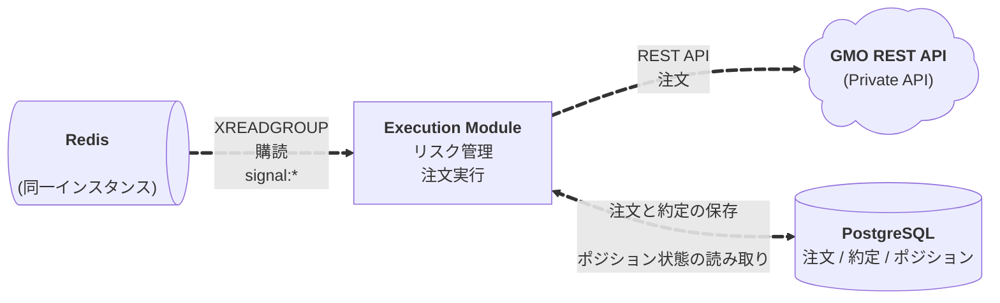

# Execution Module アーキテクチャ

execution の設計と実装方針。Redis Stream からシグナルを購読し、リスク管理、注文実行、約定監視を行う。キューワーカーとして動作し、生成した注文・約定履歴を PostgreSQL に保存する。

## 目次

1. [責務と基本方針](#責務と基本方針)
2. [データフロー](#データフロー)
3. [コンポーネント設計](#コンポーネント設計)
4. [リスク管理](#リスク管理)
5. [注文実行](#注文実行)
6. [データベース設計](#データベース設計)
7. [ディレクトリ構成](#ディレクトリ構成)
8. [設定管理](#設定管理)
9. [参考資料](#参考資料)

---

## 責務と基本方針

### 責務

execution は以下の責務を持つ:

- **シグナル購読**: Redis Stream からシグナルを購読（`signal:*`）を Consumer Group で購読（キューワーカーとして動作）
- **リスク管理**: ポジションサイズ、ドローダウン、連続損失などのリスクチェック
- **ポジション管理**: 現在のポジション状態を DB から取得・更新
- **注文発行**: REST API で注文を発行（ccxt または取引所 SDK）
- **約定監視**: 注文状態を監視して状態遷移（NEW→PARTIALLY_FILLED→FILLED/CANCELED）
- **データ永続化**: 注文・約定履歴を PostgreSQL に保存

### 基本方針

- **イベント駆動**: Redis Stream からシグナルを購読し、リアルタイムで処理
- **取りこぼしゼロ**: Consumer Group を使用して、再起動時もデータを取りこぼさない
- **キューワーカーとして動作**: Redis Stream を購読してメッセージを処理するバックグラウンドワーカー
- **リスク管理の徹底**: ポジションサイズ、ドローダウン、連続損失を厳格にチェック
- **エンティティ共有**: strategy とエンティティクラス（モデル）を共有し、一貫性を保つ（`domain/models/`）

---

## データフロー

### 全体フロー




### Execution ユースケースのメインループ（Application 層）

```python
# application/usecases/execution/main.py
from infrastructure.redis.consumer import RedisStreamConsumer
from application.usecases.execution.risk_manager import RiskManagerUseCase
from application.usecases.execution.order_executor import OrderExecutorUseCase
from infrastructure.database.repositories.position_repository import PositionRepository
from infrastructure.database.repositories.order_repository import OrderRepository
from infrastructure.broker.gmo.client import GmoClient
from infrastructure.logger.db_logger import DBLogger

# Infrastructure 層のコンポーネントを注入
redis_consumer = RedisStreamConsumer(REDIS_URL)
position_repo = PositionRepository(DATABASE_URL)
order_repo = OrderRepository(DATABASE_URL)
broker_client = GmoClient(API_KEY, API_SECRET)
db_logger = DBLogger(DATABASE_URL)

# Application 層のユースケースを初期化
risk_manager = RiskManagerUseCase(position_repo, MAX_POSITION_SIZE, MAX_DRAWDOWN_PCT)
order_executor = OrderExecutorUseCase(broker_client, order_repo)

# Consumer Group でシグナルを購読
for message in redis_consumer.consume(
    group="execution",
    consumer="execution-1",
    streams={"signal:gmo": ">"}
):
    signal = parse_signal(message)  # Domain 層の Signal エンティティに変換

    # Application 層のユースケースを実行
    if not risk_manager.check_risk(signal):
        db_logger.log_rejected_signal(signal, reason="risk_limit")
        continue

    order = order_executor.execute(signal)

    # Infrastructure 層のリポジトリを使用
    order_repo.save(order)
    db_logger.log_order(order)

    # 約定監視（非同期）
    asyncio.create_task(monitor_order(order))
```

### データフロー詳細（レイヤードアーキテクチャ）

#### Execution ユースケースのフロー

1. **Infrastructure 層**: Redis Stream からシグナル（`signal:*`）を購読（XREADGROUP）
2. **Application 層**: リスク管理ユースケースを実行（Infrastructure 層の PositionRepository を使用して DB から取得）
3. **Application 層**: 注文実行ユースケースを実行（Infrastructure 層の BrokerClient を使用）
4. **Infrastructure 層**: 約定/注文状態を監視
5. **Infrastructure 層**: 注文・約定履歴を PostgreSQL に保存（リポジトリ経由）

---

## コンポーネント設計

### Domain 層のコンポーネント

#### エンティティクラス

**責務**:
- ビジネスロジックに依存しない、純粋なデータ構造
- ドメインの概念を表現

**配置**: `domain/models/`

**主要エンティティ**:
- `Signal`: シグナルのエンティティ（strategy と共有）
- `Order`: 注文のエンティティ
- `Execution`: 約定のエンティティ
- `Position`: ポジションのエンティティ

**注意**: `Signal` エンティティは strategy でも使用されるため、`domain/models/` 配下で共有されます。

### Application 層のコンポーネント

#### Execution ユースケース

**責務**:
- リスク管理、注文実行のオーケストレーション
- Infrastructure 層のコンポーネントを組み合わせて、1つのビジネス操作を実現

**配置**: `application/usecases/execution/`

**主要ユースケース**:
- `risk_manager.py`: リスク管理ユースケース
- `order_executor.py`: 注文実行ユースケース

#### インターフェース（契約）

**責務**:
- Infrastructure 層が実装すべきインターフェースを定義
- 依存性逆転の原則（DIP）を実現

**配置**:
- **共有インターフェース**: `shared/application/interfaces/`（`ohlcv_repository.py`, `signal_repository.py`）
- **モジュール固有インターフェース**: `application/interfaces/`（`order_repository.py`, `position_repository.py`, `execution_repository.py`）

**主要インターフェース**:
- `order_repository.py`: Order リポジトリインターフェース（モジュール固有）
- `position_repository.py`: Position リポジトリインターフェース（モジュール固有）
- `execution_repository.py`: Execution リポジトリインターフェース（モジュール固有）
- `signal_repository.py`: Signal リポジトリインターフェース（`shared/application/interfaces/` から共有、必要に応じて使用）
- `ohlcv_repository.py`: OHLCV リポジトリインターフェース（`shared/application/interfaces/` から共有、必要に応じて使用）

### Infrastructure 層のコンポーネント

#### Redis 接続

**責務**:
- Redis Stream からの購読実装

**配置**: `infrastructure/redis/`

**主要コンポーネント**:
- `consumer.py`: Redis Stream Consumer（購読実装）

#### データベース接続

**責務**:
- PostgreSQL への接続管理
- リポジトリの実装（Application 層のインターフェースを実装）

**配置**: `infrastructure/database/`

**主要コンポーネント**:
- `connection.py`: DB 接続管理
- `schema.py`: SQLAlchemy モデル定義
- `repositories/order_repository.py`: Order リポジトリ実装
- `repositories/position_repository.py`: Position リポジトリ実装
- `repositories/execution_repository.py`: Execution リポジトリ実装

#### 取引所API連携

**責務**:
- 取引所 REST API との連携実装
- 注文発行、約定監視の実装

**配置**: `infrastructure/broker/`

**主要コンポーネント**:
- `gmo/client.py`: GMO コイン REST API クライアント
- `gmo/order_executor.py`: GMO コイン注文実行実装
- `monitor.py`: 注文監視実装

#### ログ実装

**責務**:
- 構造化ログの実装
- stdout と DB への二重出力

**配置**: `infrastructure/logger/`

**主要コンポーネント**:
- `db_logger.py`: DBLogger 実装

---

## リスク管理

### ポジションサイズ制限

**最大ポジションサイズをチェック**:
- 現在のポジション + 新規注文サイズが上限を超えないか確認
- シンボルごとに独立した上限を設定可能

**実装例**:
```python
# application/usecases/execution/risk_manager.py
from domain.models.signal import Signal
from domain.models.position import Position

class RiskManagerUseCase:
    def __init__(self, position_repo: PositionRepository, max_position_size: float):
        self.position_repo = position_repo
        self.max_position_size = max_position_size

    def check_risk(self, signal: Signal) -> bool:
        # 現在のポジションを取得
        current_position = self.position_repo.get_current_position(
            signal.exchange, signal.symbol
        )

        # ポジションサイズチェック
        if current_position and current_position.size >= self.max_position_size:
            return False

        return True
```

### ドローダウン制限

**直近 N 日間の損益を計算**:
- 最大ドローダウン率を超えた場合は取引を停止
- ドローダウン率 = (最大値 - 現在値) / 最大値 × 100

### 連続損失制限

**連続損失回数をカウント**:
- 閾値を超えた場合は取引を一時停止
- 連続損失回数は DB から取得

---

## 注文実行

### 注文タイプ

**指値注文（Limit Order）**:
- 指定価格で注文を板に置く（Maker）
- 手数料が安い（Maker 手数料）

**成行注文（Market Order）**:
- 即座に約定を優先（Taker）
- 手数料が高い（Taker 手数料）

### 注文状態管理

**状態遷移**:
- NEW: 注文が発行された
- PARTIALLY_FILLED: 一部約定
- FILLED: 完全約定
- CANCELED: 取消
- REJECTED: 拒否

**実装例**:
```python
# infrastructure/broker/gmo/order_executor.py
from domain.models.signal import Signal
from domain.models.order import Order

class GmoOrderExecutor:
    def __init__(self, client: GmoClient):
        self.client = client

    async def execute(self, signal: Signal) -> Order:
        # シグナルから注文パラメータを生成
        order_params = self._build_order_params(signal)

        # REST API で注文発行
        response = await self.client.place_order(order_params)

        # Order エンティティに変換
        return Order(
            exchange=signal.exchange,
            symbol=signal.symbol,
            order_id=response['order_id'],
            signal_id=signal.id,
            side=signal.action.split('_')[-1].upper(),  # 'enter_long' -> 'LONG'
            order_type='LIMIT',
            price=signal.price_ref,
            size=signal.size,
            status='NEW'
        )
```

### 約定監視

**ポーリング方式**:
- REST API で定期的に注文状態を確認
- 約定イベントを検知して処理

**WebSocket 方式（将来）**:
- 取引所が Private WebSocket を提供している場合、リアルタイムで約定イベントを受信

**実装例**:
```python
# infrastructure/broker/monitor.py
async def monitor_order(order: Order):
    while order.status not in ['FILLED', 'CANCELED', 'REJECTED']:
        # REST API で注文状態を取得
        status = await broker_client.get_order_status(order.order_id)

        # 状態を更新
        order.status = status['status']
        order_repo.update(order)

        # 約定情報があれば保存
        if status.get('executions'):
            for exec_data in status['executions']:
                execution = Execution.from_dict(exec_data)
                execution_repo.save(execution)

        await asyncio.sleep(1)  # 1秒待機
```

---

## データベース設計

### orders テーブル

発行した注文を記録するテーブル。

**スキーマ**:
```sql
CREATE TABLE orders (
    id SERIAL PRIMARY KEY,
    exchange VARCHAR(50) NOT NULL,
    symbol VARCHAR(20) NOT NULL,
    order_id VARCHAR(100) NOT NULL UNIQUE,  -- 取引所の注文ID
    signal_id INTEGER REFERENCES signals(id),
    side VARCHAR(10) NOT NULL,  -- 'BUY', 'SELL'
    order_type VARCHAR(20) NOT NULL,  -- 'LIMIT', 'MARKET'
    price DECIMAL(20, 8),
    size DECIMAL(20, 8) NOT NULL,
    status VARCHAR(20) NOT NULL,  -- 'NEW', 'PARTIALLY_FILLED', 'FILLED', 'CANCELED', 'REJECTED'
    filled_size DECIMAL(20, 8) DEFAULT 0,
    average_price DECIMAL(20, 8),
    timestamp TIMESTAMP NOT NULL DEFAULT CURRENT_TIMESTAMP,
    created_at TIMESTAMP DEFAULT CURRENT_TIMESTAMP,
    updated_at TIMESTAMP DEFAULT CURRENT_TIMESTAMP
);

CREATE INDEX idx_orders_exchange_symbol ON orders(exchange, symbol, timestamp DESC);
CREATE INDEX idx_orders_status ON orders(status, timestamp DESC);
CREATE INDEX idx_orders_signal_id ON orders(signal_id);
```

**用途**:
- 注文の履歴管理
- 注文状態の追跡
- パフォーマンス分析

### executions テーブル

約定情報を記録するテーブル。

**スキーマ**:
```sql
CREATE TABLE executions (
    id SERIAL PRIMARY KEY,
    exchange VARCHAR(50) NOT NULL,
    symbol VARCHAR(20) NOT NULL,
    order_id INTEGER REFERENCES orders(id),
    execution_id VARCHAR(100) NOT NULL UNIQUE,  -- 取引所の約定ID
    side VARCHAR(10) NOT NULL,  -- 'BUY', 'SELL'
    price DECIMAL(20, 8) NOT NULL,
    size DECIMAL(20, 8) NOT NULL,
    fee DECIMAL(20, 8) DEFAULT 0,
    timestamp TIMESTAMP NOT NULL,
    created_at TIMESTAMP DEFAULT CURRENT_TIMESTAMP
);

CREATE INDEX idx_executions_exchange_symbol ON executions(exchange, symbol, timestamp DESC);
CREATE INDEX idx_executions_order_id ON executions(order_id);
CREATE INDEX idx_executions_timestamp ON executions(timestamp DESC);
```

**用途**:
- 約定履歴の管理
- 損益計算
- 税金計算用のデータ

### positions テーブル

現在のポジションを管理するテーブル（リスク管理用）。

**スキーマ**:
```sql
CREATE TABLE positions (
    id SERIAL PRIMARY KEY,
    exchange VARCHAR(50) NOT NULL,
    symbol VARCHAR(20) NOT NULL,
    side VARCHAR(10) NOT NULL,  -- 'LONG', 'SHORT'
    size DECIMAL(20, 8) NOT NULL,
    average_price DECIMAL(20, 8) NOT NULL,
    unrealized_pnl DECIMAL(20, 8) DEFAULT 0,
    realized_pnl DECIMAL(20, 8) DEFAULT 0,
    updated_at TIMESTAMP DEFAULT CURRENT_TIMESTAMP,
    UNIQUE(exchange, symbol)
);

CREATE INDEX idx_positions_exchange_symbol ON positions(exchange, symbol);
```

**用途**:
- 現在のポジション状態の管理
- リスク管理（最大ポジションサイズチェック）
- 損益計算

---

## ディレクトリ構成

### レイヤードアーキテクチャ

execution はレイヤードアーキテクチャを採用し、責務に基づいて層を分離します。

```
services/
└── execution/
    ├── execution_engine/
    │   ├── __init__.py
    │   ├── config.py              # 設定管理
    │   ├── main.py                # エントリーポイント（Execution メインループ）
    │   │
    │   ├── domain/                 # ドメイン層: ビジネスロジックとエンティティ
    │   │   ├── __init__.py
    │   │   ├── models/            # モジュール固有のエンティティクラス（現時点では空）
    │   │   │   └── __init__.py
    │   │   ├── entities/          # ドメインエンティティ（将来拡張用）
    │   │   └── value_objects/     # 値オブジェクト（将来拡張用）
    │   │
    │   ├── application/            # アプリケーション層: ユースケースとインターフェース
    │   │   ├── __init__.py
    │   │   ├── usecases/          # ユースケース（Execution）
    │   │   │   ├── __init__.py
    │   │   │   └── execution/    # Execution ユースケース
    │   │   │       ├── __init__.py
    │   │   │       ├── main.py   # Execution メインループ
    │   │   │       ├── risk_manager.py  # リスク管理ユースケース
    │   │   │       └── order_executor.py  # 注文実行ユースケース
    │   │   ├── interfaces/        # インターフェース定義
    │   │   │   ├── __init__.py
    │   │   │   ├── order_repository.py  # Order リポジトリインターフェース
    │   │   │   ├── position_repository.py  # Position リポジトリインターフェース
    │   │   │   └── execution_repository.py  # Execution リポジトリインターフェース
    │   │
    │   └── infrastructure/         # インフラ層: 外部システム連携
    │       ├── __init__.py
    │       ├── redis/             # Redis 接続
    │       │   ├── __init__.py
    │       │   └── consumer.py   # Redis Stream Consumer
    │       ├── database/          # PostgreSQL 接続
    │       │   ├── __init__.py
    │       │   ├── connection.py  # DB 接続管理
    │       │   ├── schema.py      # SQLAlchemy モデル定義
    │       │   ├── repositories/  # リポジトリ実装
    │       │   │   ├── __init__.py
    │       │   │   ├── order_repository.py
    │       │   │   ├── position_repository.py
    │       │   │   └── execution_repository.py
    │       │   └── migrations/    # Alembic マイグレーション
    │       ├── broker/            # 取引所API連携
    │       │   ├── __init__.py
    │       │   ├── gmo/          # GMO コイン実装
    │       │   │   ├── __init__.py
    │       │   │   ├── client.py  # REST API クライアント
    │       │   │   └── order_executor.py  # 注文実行実装
    │       │   └── monitor.py    # 注文監視実装
    │       └── logger/            # ログ実装
    │           ├── __init__.py
    │           └── db_logger.py  # DBLogger 実装
    │
    ├── tests/
    │   ├── __init__.py
    │   ├── unit/
    │   │   ├── domain/
    │   │   ├── application/
    │   │   └── infrastructure/
    │   └── integration/
    │
    ├── Dockerfile
    ├── pyproject.toml
    ├── .env.example
    └── README.md
```

### レイヤーの責務

#### Domain 層（ドメイン層）

**責務**:
- ビジネスロジックに依存しない、純粋な型定義やドメインモデル
- エンティティクラス（Signal, Order, Execution, Position）
- 値オブジェクト（将来拡張用）

**特徴**:
- 外部システム（Redis、DB、取引所API）に依存しない
- ビジネスルール・概念の定義

#### Application 層（アプリケーション層）

**責務**:
- ユースケースの実装（Execution ユースケース）
- インターフェース（契約）の定義
- オーケストレーション（複数のドメインサービスやインフラコンポーネントを組み合わせて、1つのビジネス操作を実現）
- トランザクション管理
- 入力の検証・変換

**ユースケース例**:
- `execution/risk_manager.py`: リスク管理ユースケース
- `execution/order_executor.py`: 注文実行ユースケース

#### Infrastructure 層（インフラ層）

**責務**:
- 外部システム（Redis、PostgreSQL、取引所API）との連携実装
- リポジトリの実装（Application 層のインターフェースを実装）
- ログ実装

**実装例**:
- `redis/consumer.py`: Redis Stream からの購読実装
- `database/repositories/order_repository.py`: Order リポジトリの実装
- `broker/gmo/client.py`: GMO コイン REST API クライアント

### 依存関係の方向

```
Application 層
    ↓ (依存)
Domain 層
    ↑ (実装)
Infrastructure 層
```

- **Application 層** → **Domain 層**: Application 層は Domain 層のエンティティを使用
- **Infrastructure 層** → **Domain 層**: Infrastructure 層は Domain 層のエンティティを使用
- **Infrastructure 層** → **Application 層**: Infrastructure 層は Application 層のインターフェースを実装
- **Domain 層**: 他の層に依存しない（純粋なドメインモデル）

### エンティティクラスの配置

エンティティクラスは `shared/domain/models/` 配下に定義し、Application 層と Infrastructure 層の両方から参照します。`PYTHONPATH` に `shared/` を追加することで、各モジュールからインポート可能です。

**例: Order エンティティ**:
```python
# shared/domain/models/order.py
from dataclasses import dataclass
from datetime import datetime
from decimal import Decimal
from typing import Optional

@dataclass
class Order:
    exchange: str
    symbol: str
    order_id: str  # 取引所の注文ID
    signal_id: Optional[int] = None
    side: str  # 'BUY', 'SELL'
    order_type: str  # 'LIMIT', 'MARKET'
    price: Optional[Decimal] = None
    size: Decimal
    status: str  # 'NEW', 'PARTIALLY_FILLED', 'FILLED', 'CANCELED', 'REJECTED'
    filled_size: Decimal = Decimal('0')
    average_price: Optional[Decimal] = None
    timestamp: datetime = None

    def __post_init__(self):
        if self.timestamp is None:
            self.timestamp = datetime.now()
```

---

## 設定管理

### 環境変数（.env）

execution の設定は環境変数で管理する。

**必須設定**:
```env
# Redis 設定
REDIS_URL=redis://redis:6379/0

# PostgreSQL 設定
DATABASE_URL=postgresql://bot:password@db:5432/bot_db

# 購読設定
SYMBOLS=BTC_JPY,ETH_JPY

# リスク管理設定
MAX_POSITION_SIZE=0.05  # BTC等の上限
MAX_DRAWDOWN_PCT=5      # 最大ドローダウン率（%）
MAX_CONSECUTIVE_LOSSES=5 # 最大連続損失回数

# 取引所API設定
EXCHANGE_NAME=gmo
REST_BASE_URL=https://api.coin.z.com
API_KEY=xxxx
API_SECRET=yyyy

# ログ設定
LOG_LEVEL=INFO
```

### 設定の読み込み

`config.py` で環境変数を読み込む。

```python
import os
from typing import List

class Config:
    # Redis 設定
    REDIS_URL: str = os.getenv("REDIS_URL", "redis://localhost:6379/0")

    # PostgreSQL 設定
    DATABASE_URL: str = os.getenv("DATABASE_URL", "")

    # 購読設定
    SYMBOLS: List[str] = os.getenv("SYMBOLS", "BTC_JPY").split(",")

    # リスク管理設定
    MAX_POSITION_SIZE: float = float(os.getenv("MAX_POSITION_SIZE", "0.05"))
    MAX_DRAWDOWN_PCT: float = float(os.getenv("MAX_DRAWDOWN_PCT", "5"))
    MAX_CONSECUTIVE_LOSSES: int = int(os.getenv("MAX_CONSECUTIVE_LOSSES", "5"))

    # 取引所API設定
    EXCHANGE_NAME: str = os.getenv("EXCHANGE_NAME", "gmo")
    REST_BASE_URL: str = os.getenv("REST_BASE_URL", "")
    API_KEY: str = os.getenv("API_KEY", "")
    API_SECRET: str = os.getenv("API_SECRET", "")

    # ログ設定
    LOG_LEVEL: str = os.getenv("LOG_LEVEL", "INFO")
```

---

## 参考資料

- [GMOコイン API Documentation](https://api.coin.z.com/docs/)
- [architecture.md](./01_architecture.md) - システム全体のアーキテクチャ
- [strategy 設計](./03_strategy.md) - Strategy モジュールの設計
- [trading_domain.md](../domain/trading_domain.md) - 取引ドメインのルール
- [coding_standards.md](../coding_standards.md) - コード規約

