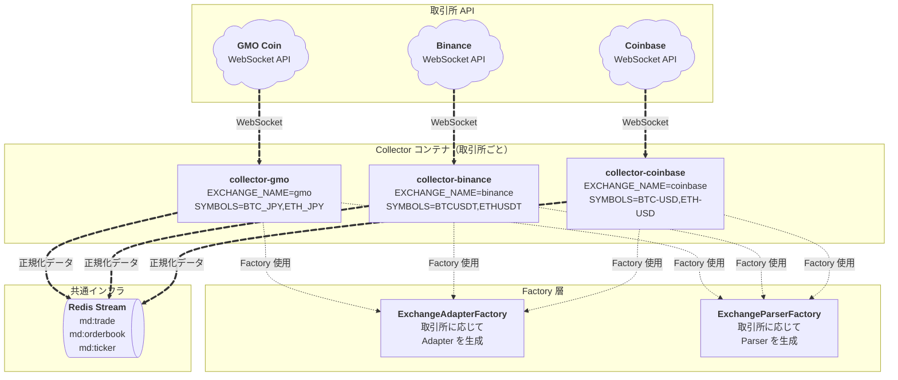

# 取引所拡張設計：取引所ごとのコンテナ展開パターン

複数の取引所に対応するための拡張設計。取引所ごとに独立した collector コンテナを起動し、同じ collector イメージを使用して環境変数で取引所を切り替える方式を採用する。

## 目次

1. [設計方針](#設計方針)
2. [アーキテクチャ](#アーキテクチャ)
3. [Factory パターンの実装](#factory-パターンの実装)
4. [docker-compose の拡張](#docker-compose-の拡張)
5. [環境変数の設定](#環境変数の設定)
6. [運用方法](#運用方法)
7. [メリット・デメリット](#メリットデメリット)
8. [新しい取引所の追加手順](#新しい取引所の追加手順)

---

## 設計方針

### 基本原則

- **1コンテナ = 1取引所**: 各取引所ごとに独立した collector コンテナを起動
- **同じイメージ、異なる設定**: 同じ collector イメージを使用し、環境変数で取引所を切り替え
- **障害分離**: 1つの取引所で問題が発生しても、他の取引所に影響しない
- **独立スケーリング**: 取引所ごとに独立してスケール可能

### 拡張性の確保

- **Factory パターン**: 取引所ごとの Adapter と Parser を生成する Factory を実装
- **インターフェースベース**: `MarketDataAdapter` と `MessageParser` インターフェースで統一
- **型安全性**: TypeScript の型システムで取引所名を型安全に管理

---

## アーキテクチャ

### 全体構成図



### データフロー

```
取引所 API → Collector コンテナ → Factory → Adapter/Parser → 正規化 → Redis Stream
```

各 collector コンテナは独立して動作し、同じ Redis Stream にデータを配信する。

---

## Factory パターンの実装

### ExchangeAdapterFactory

取引所ごとの `MarketDataAdapter` 実装を生成する Factory。

```typescript
// services/collector/src/infra/factories/ExchangeAdapterFactory.ts
import type { MarketDataAdapter } from '@/application/interfaces/MarketDataAdapter';
import { GmoAdapter } from '@/infra/adapters/gmo/GmoAdapter';
// import { BinanceAdapter } from '@/infra/adapters/binance/BinanceAdapter';
// import { CoinbaseAdapter } from '@/infra/adapters/coinbase/CoinbaseAdapter';

export type ExchangeName = 'gmo' | 'binance' | 'coinbase';

export class ExchangeAdapterFactory {
  static create(
    exchange: ExchangeName,
    symbol: string,
    wsUrl: string,
    onMessage: (data: string | ArrayBuffer | Blob) => Promise<void>,
    onClose: () => void,
    onError: (event: Event) => void
  ): MarketDataAdapter {
    switch (exchange) {
      case 'gmo':
        return new GmoAdapter(symbol, wsUrl, onMessage, onClose, onError);
      // case 'binance':
      //   return new BinanceAdapter(symbol, wsUrl, onMessage, onClose, onError);
      // case 'coinbase':
      //   return new CoinbaseAdapter(symbol, wsUrl, onMessage, onClose, onError);
      default:
        throw new Error(`Unsupported exchange: ${exchange}`);
    }
  }
}
```

### ExchangeParserFactory

取引所ごとの `MessageParser` 実装を生成する Factory。

```typescript
// services/collector/src/infra/factories/ExchangeParserFactory.ts
import type { MessageParser } from '@/application/interfaces/MessageParser';
import { GmoMessageParser } from '@/infra/adapters/gmo/GmoMessageParser';
// import { BinanceMessageParser } from '@/infra/adapters/binance/BinanceMessageParser';
// import { CoinbaseMessageParser } from '@/infra/adapters/coinbase/CoinbaseMessageParser';
import type { ExchangeName } from './ExchangeAdapterFactory';

export class ExchangeParserFactory {
  static create(exchange: ExchangeName): MessageParser {
    switch (exchange) {
      case 'gmo':
        return new GmoMessageParser();
      // case 'binance':
      //   return new BinanceMessageParser();
      // case 'coinbase':
      //   return new CoinbaseMessageParser();
      default:
        throw new Error(`Unsupported exchange: ${exchange}`);
    }
  }
}
```

### main.ts の変更

Factory を使用するように `main.ts` を変更。

```typescript
// services/collector/src/main.ts
import 'dotenv/config';
import process from 'node:process';
import { PublishStreamUsecase } from '@/application/usecases/PublishStreamUsecase';
import { ExchangeAdapterFactory, type ExchangeName } from '@/infra/factories/ExchangeAdapterFactory';
import { ExchangeParserFactory } from '@/infra/factories/ExchangeParserFactory';
import { StreamRepository } from '@/infra/redis/StreamRepository';
import { WebSocketHandler } from '@/presentation/websocket/WebSocketHandler';

async function bootstrap(): Promise<void> {
  const EXCHANGE_NAME = requireEnv('EXCHANGE_NAME') as ExchangeName;
  const WS_PUBLIC_URL = requireEnv('WS_PUBLIC_URL');
  const SYMBOLS = requireEnv('SYMBOLS');
  const REDIS_URL = requireEnv('REDIS_URL');

  // Factory を使って Parser を生成（取引所に応じて自動選択）
  const parser = ExchangeParserFactory.create(EXCHANGE_NAME);
  const publisher = new StreamRepository(REDIS_URL);
  const usecase = new PublishStreamUsecase(parser, publisher);

  const symbols = SYMBOLS.split(',')
    .map((symbol) => symbol.trim())
    .filter(Boolean);

  const handlers = symbols.map((symbol) => {
    const handlerRef: { handler?: WebSocketHandler } = {};

    // Factory を使って Adapter を生成（取引所に応じて自動選択）
    const adapter = ExchangeAdapterFactory.create(
      EXCHANGE_NAME,
      symbol,
      WS_PUBLIC_URL,
      async (data) => {
        if (handlerRef.handler) {
          await handlerRef.handler.handleMessage(data);
        }
      },
      () => {
        if (handlerRef.handler) {
          handlerRef.handler.reconnectManager.scheduleReconnect();
        }
      },
      (event) => {
        console.error(`[main] socket error for ${symbol}:`, event);
        if (handlerRef.handler) {
          handlerRef.handler.reconnectManager.scheduleReconnect();
        }
      }
    );

    const handler = new WebSocketHandler(adapter, usecase);
    handlerRef.handler = handler;
    return handler;
  });

  await Promise.all(handlers.map((handler) => handler.start()));

  // ... 以下同じ
}
```

---

## docker-compose の拡張

### 複数取引所対応の docker-compose

```yaml
version: "3.9"

name: alpha-market-engine

services:
  # GMO コイン用の collector
  collector-gmo:
    build:
      context: ./services/collector
      dockerfile: Dockerfile
    container_name: collector-gmo
    restart: unless-stopped
    env_file:
      - .env
      - ./services/collector/.env.gmo  # GMO 固有の環境変数
    environment:
      EXCHANGE_NAME: gmo
      WS_PUBLIC_URL: wss://api.coin.z.com/ws/public/v1
      SYMBOLS: BTC_JPY,ETH_JPY
      REDIS_URL: redis://redis:6379/0
      LOG_LEVEL: ${LOG_LEVEL:-INFO}
    depends_on:
      - redis
    networks:
      - bot-net
    volumes:
      - ./services/collector/src:/app/src
      - ./services/collector/tsconfig.json:/app/tsconfig.json
    command: ["npm", "run", "dev"]

  # Binance用の collector
  collector-binance:
    build:
      context: ./services/collector
      dockerfile: Dockerfile
    container_name: collector-binance
    restart: unless-stopped
    env_file:
      - .env
      - ./services/collector/.env.binance  # Binance 固有の環境変数
    environment:
      EXCHANGE_NAME: binance
      WS_PUBLIC_URL: wss://stream.binance.com:9443/ws
      SYMBOLS: BTCUSDT,ETHUSDT
      REDIS_URL: redis://redis:6379/0
      LOG_LEVEL: ${LOG_LEVEL:-INFO}
    depends_on:
      - redis
    networks:
      - bot-net
    volumes:
      - ./services/collector/src:/app/src
      - ./services/collector/tsconfig.json:/app/tsconfig.json
    command: ["npm", "run", "dev"]

  # Coinbase用の collector
  collector-coinbase:
    build:
      context: ./services/collector
      dockerfile: Dockerfile
    container_name: collector-coinbase
    restart: unless-stopped
    env_file:
      - .env
      - ./services/collector/.env.coinbase  # Coinbase 固有の環境変数
    environment:
      EXCHANGE_NAME: coinbase
      WS_PUBLIC_URL: wss://ws-feed.exchange.coinbase.com
      SYMBOLS: BTC-USD,ETH-USD
      REDIS_URL: redis://redis:6379/0
      LOG_LEVEL: ${LOG_LEVEL:-INFO}
    depends_on:
      - redis
    networks:
      - bot-net
    volumes:
      - ./services/collector/src:/app/src
      - ./services/collector/tsconfig.json:/app/tsconfig.json
    command: ["npm", "run", "dev"]

  # 共通サービス（既存のまま）
  redis:
    image: redis:8.4.0-alpine
    container_name: redis
    restart: unless-stopped
    ports:
      - "6379:6379"
    networks:
      - bot-net
    volumes:
      - redis-data:/data
    command: ["redis-server", "--appendonly", "yes"]

  # strategy, db などは既存のまま
  strategy:
    # ... 既存の設定

networks:
  bot-net:
    driver: bridge

volumes:
  redis-data:
```

### 起動方法

```bash
# すべての取引所の collector を起動
docker-compose up collector-gmo collector-binance collector-coinbase

# 特定の取引所のみ起動
docker-compose up collector-gmo

# バックグラウンドで起動
docker-compose up -d collector-gmo collector-binance
```

---

## 環境変数の設定

### 取引所ごとの環境変数ファイル

#### `.env.gmo`

```bash
EXCHANGE_NAME=gmo
WS_PUBLIC_URL=wss://api.coin.z.com/ws/public/v1
SYMBOLS=BTC_JPY,ETH_JPY
REDIS_URL=redis://redis:6379/0
LOG_LEVEL=INFO
```

#### `.env.binance`

```bash
EXCHANGE_NAME=binance
WS_PUBLIC_URL=wss://stream.binance.com:9443/ws
SYMBOLS=BTCUSDT,ETHUSDT
REDIS_URL=redis://redis:6379/0
LOG_LEVEL=INFO
```

#### `.env.coinbase`

```bash
EXCHANGE_NAME=coinbase
WS_PUBLIC_URL=wss://ws-feed.exchange.coinbase.com
SYMBOLS=BTC-USD,ETH-USD
REDIS_URL=redis://redis:6379/0
LOG_LEVEL=INFO
```

---

## 運用方法

### コンテナの管理

```bash
# すべての collector コンテナの状態を確認
docker-compose ps | grep collector

# 特定の取引所のログを確認
docker-compose logs -f collector-gmo

# 特定の取引所を再起動
docker-compose restart collector-gmo

# 特定の取引所を停止
docker-compose stop collector-gmo

# 特定の取引所を削除
docker-compose rm -f collector-gmo
```

### 監視とメトリクス

各 collector コンテナは独立しているため、取引所ごとに以下を監視可能：

- **接続状態**: WebSocket 接続の確立・切断
- **メッセージ数**: 受信メッセージ数、配信メッセージ数
- **エラー率**: パースエラー、接続エラーの発生率
- **レイテンシ**: メッセージ受信から Redis 配信までの時間

### ログの分離

取引所ごとにコンテナが分離されているため、ログも自動的に分離される：

```bash
# GMO のログのみ確認
docker-compose logs collector-gmo

# Binance のログのみ確認
docker-compose logs collector-binance

# すべての collector のログを確認
docker-compose logs collector-gmo collector-binance collector-coinbase
```

---

## メリット・デメリット

### メリット

1. **障害分離**: 1つの取引所で問題が発生しても、他の取引所に影響しない
2. **独立スケーリング**: 取引所ごとに独立してスケール可能（リソース制限の設定も可能）
3. **設定管理**: 取引所ごとに環境変数を分離でき、管理が容易
4. **デバッグ容易性**: ログやメトリクスを取引所ごとに分離できる
5. **リソース管理**: 取引所ごとに CPU/メモリ制限を設定可能
6. **展開の柔軟性**: 必要な取引所のみ起動可能

### デメリット

1. **リソース消費**: 取引所が増えると、コンテナ数が増えてリソース消費が増える
2. **管理の複雑化**: コンテナ数が増えると、管理がやや複雑になる
3. **起動時間**: 複数のコンテナを起動するため、全体の起動時間が長くなる可能性

### 代替案との比較

#### 1コンテナで複数取引所を扱う場合

**メリット**:
- リソース消費が少ない
- 管理がシンプル

**デメリット**:
- 1つの取引所で問題が起きると全体に影響
- ログが混在しやすい
- スケーリングが難しい

**結論**: 取引所ごとのコンテナ展開パターンが推奨される。障害分離と運用の柔軟性を重視するため。

---

## 新しい取引所の追加手順

### 1. Adapter と Parser の実装

```typescript
// services/collector/src/infra/adapters/binance/BinanceAdapter.ts
import type { MarketDataAdapter } from '@/application/interfaces/MarketDataAdapter';
// ... Binance 固有の実装

export class BinanceAdapter implements MarketDataAdapter {
  // Binance 固有の WebSocket 接続・購読ロジック
}

// services/collector/src/infra/adapters/binance/BinanceMessageParser.ts
import type { MessageParser } from '@/application/interfaces/MessageParser';
// ... Binance 固有のパース実装

export class BinanceMessageParser implements MessageParser {
  // Binance メッセージを NormalizedEvent に変換
}
```

### 2. Factory への登録

```typescript
// ExchangeAdapterFactory.ts
import { BinanceAdapter } from '@/infra/adapters/binance/BinanceAdapter';

export type ExchangeName = 'gmo' | 'binance' | 'coinbase'; // binance を追加

export class ExchangeAdapterFactory {
  static create(...) {
    switch (exchange) {
      // ...
      case 'binance':
        return new BinanceAdapter(symbol, wsUrl, onMessage, onClose, onError);
      // ...
    }
  }
}

// ExchangeParserFactory.ts
import { BinanceMessageParser } from '@/infra/adapters/binance/BinanceMessageParser';

export class ExchangeParserFactory {
  static create(exchange: ExchangeName) {
    switch (exchange) {
      // ...
      case 'binance':
        return new BinanceMessageParser();
      // ...
    }
  }
}
```

### 3. docker-compose への追加

```yaml
services:
  collector-binance:
    build:
      context: ./services/collector
      dockerfile: Dockerfile
    container_name: collector-binance
    environment:
      EXCHANGE_NAME: binance
      WS_PUBLIC_URL: wss://stream.binance.com:9443/ws
      SYMBOLS: BTCUSDT,ETHUSDT
      # ...
```

### 4. 環境変数ファイルの作成

```bash
# services/collector/.env.binance
EXCHANGE_NAME=binance
WS_PUBLIC_URL=wss://stream.binance.com:9443/ws
SYMBOLS=BTCUSDT,ETHUSDT
REDIS_URL=redis://redis:6379/0
LOG_LEVEL=INFO
```

### 5. テストと起動

```bash
# ビルド
docker-compose build collector-binance

# 起動
docker-compose up collector-binance

# ログ確認
docker-compose logs -f collector-binance
```

---

## まとめ

取引所ごとのコンテナ展開パターンにより、以下の利点が得られる：

- **拡張性**: 新しい取引所の追加が容易（Factory パターン）
- **堅牢性**: 障害分離により、1つの取引所の問題が他に影響しない
- **運用性**: 取引所ごとに独立して管理・監視可能
- **スケーラビリティ**: 取引所ごとに独立してスケール可能

この設計により、複数の取引所に対応しながら、各取引所の独立性を保つことができる。
