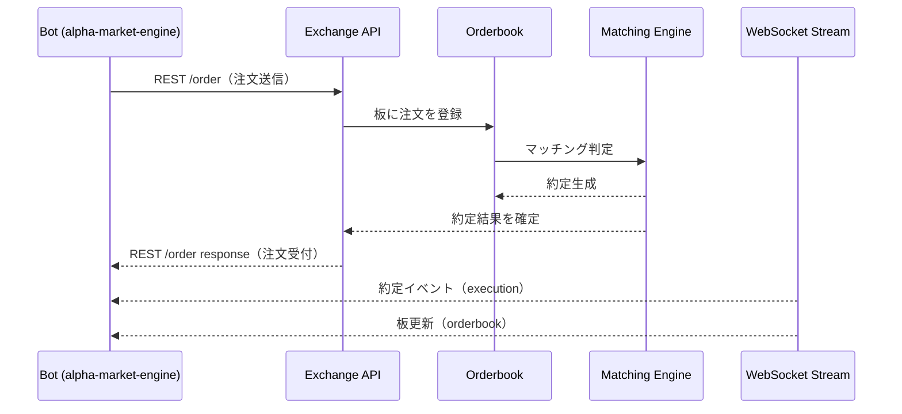

# 注文フロー（Order Flow）

alpha-market-engine が取引所に注文を送信し、約定を受け取るまでの流れを図とともに整理する。

本書は GMOコイン / BitFlyer Lightning / Binance の板取引に共通する概念に基づく。

---

## 全体フロー（Mermaid 図）

## 各段階の詳細
### 1. Bot → Exchange (REST)

Bot が取引所へ注文を送信する（指値・成行・数量・売買方向など）。

- POST /order
- API-KEY による HMAC 認証が必要（GMO / BitFlyer / Binance 共通）
- 送信後、取引所は 「注文を受け付けた」 レスポンスを返す

### 2. Exchange → Orderbook（注文の登録）

REST で受け取った注文を、取引所内部の Orderbook（板） に登録する。

- 未約定注文として積まれる
- 価格帯に応じて BID/ASK 側に入る
- Maker 注文の場合、板に残る可能性がある

### 3. Matching Engine（約定判定）

取引所内部の Matching Engine（マッチングエンジン） が、
注文と既存の板を比較し、価格条件が合えば 即約定。

- Price-Time Priority（価格優先・時間優先）
- 板を消化しつつ取引を成立させる（Taker 役）

### 4. 約定後のイベント

約定した注文は：

- 約定価格（price）
- 約定数量（size）
- 約定時刻（timestamp）
- 売買区分（side）

が決定され、取引所内部の記録に残る。

### 5. Exchange → Bot（WebSocket）

Bot は WebSocket を購読しており、以下をリアルタイム受信する：

- executions（約定履歴）
- orderbook（板更新）
- ticker（最良気配値）

Bot はこれを元に：

- ポジション更新
- ログ記録
- 次の売買判断

を行う。

### 注文フローのまとめ

| フェーズ  | 説明                   |
| ----- | -------------------- |
| 注文送信  | Bot → REST API       |
| 板登録   | 取引所の Orderbook に積まれる |
| マッチング | 条件一致で即約定             |
| 約定通知  | WebSocket で Bot が受信  |
| 状態更新  | Bot が内部ロジックを更新       |

本仕様は alpha-market-engine の戦略層（strategy）および注文管理（order manager）実装の基礎となる。

