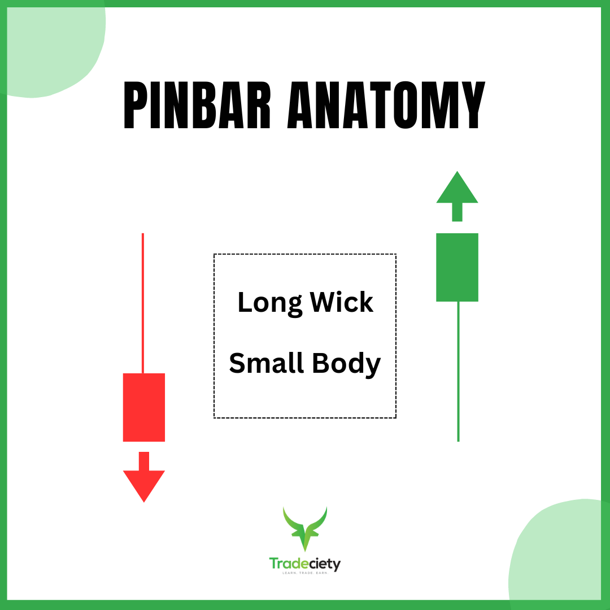
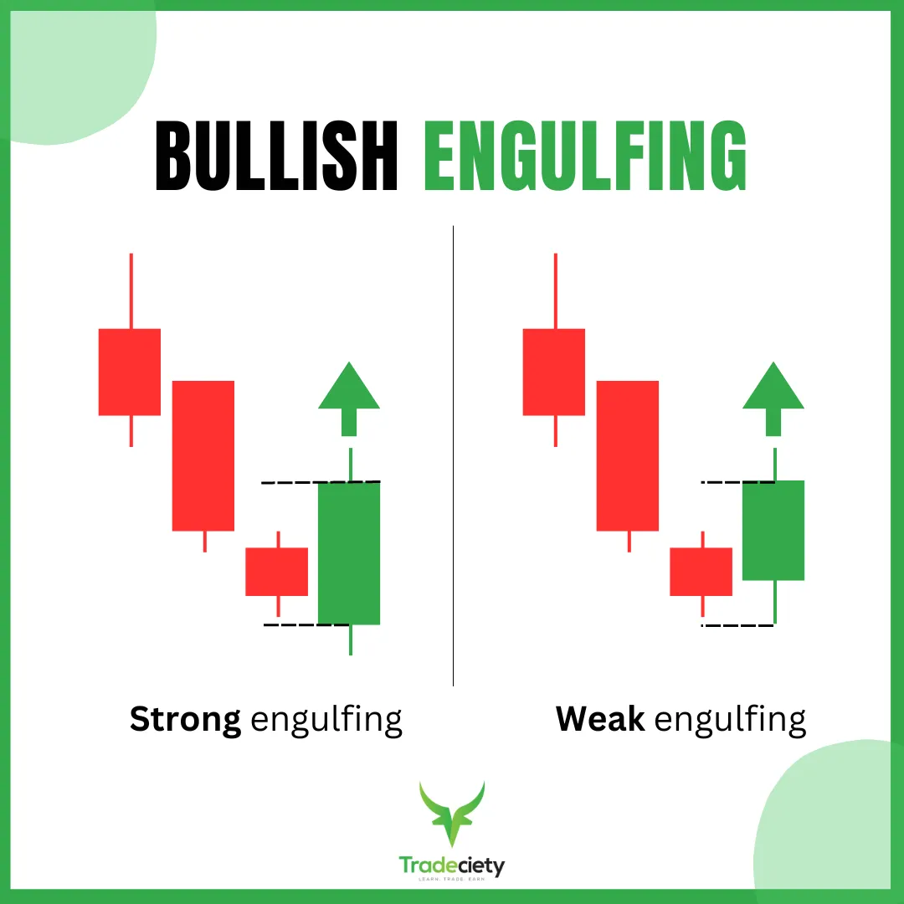
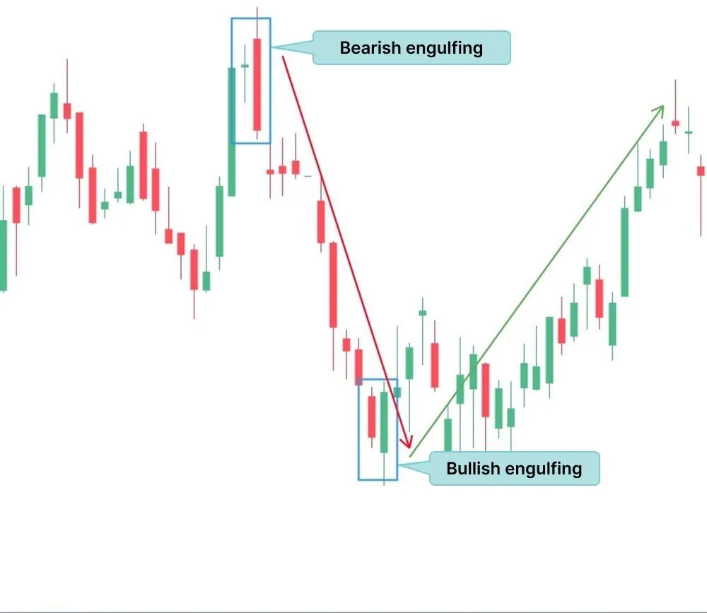
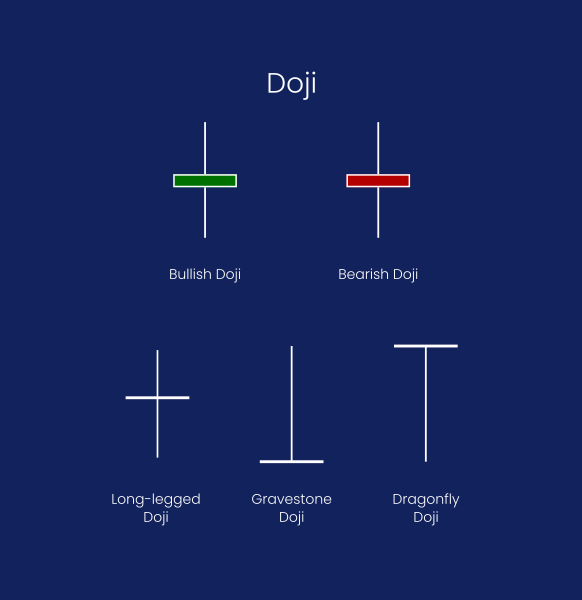
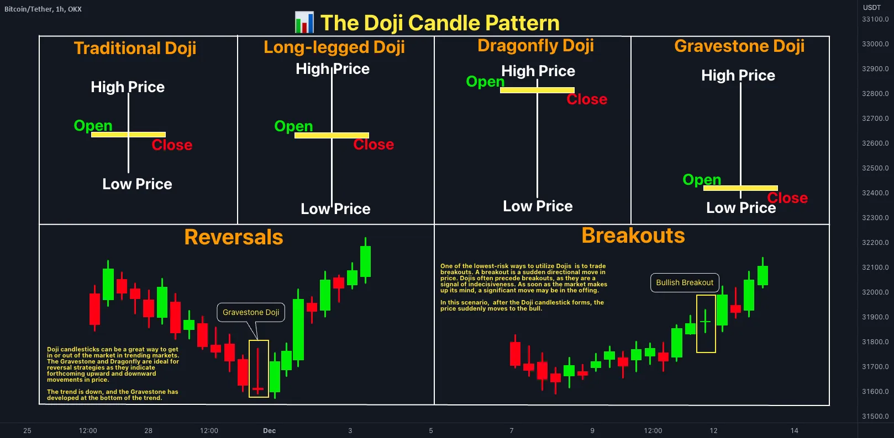
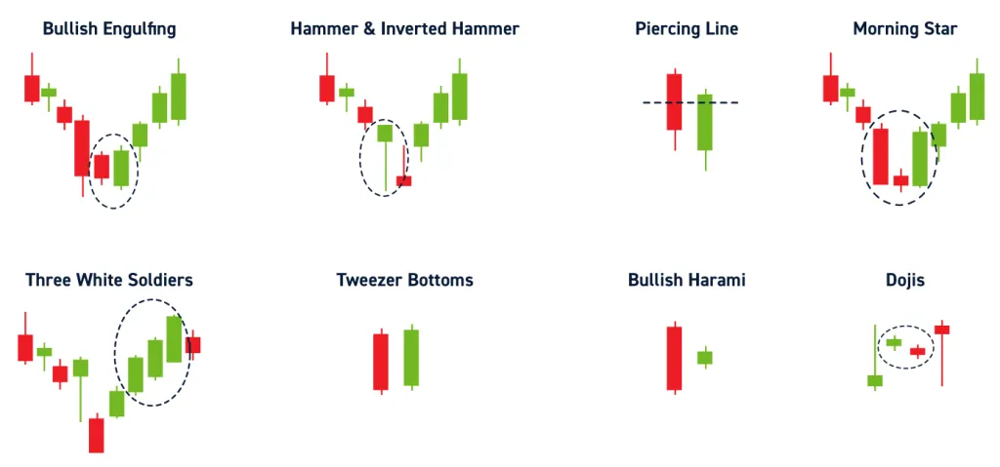
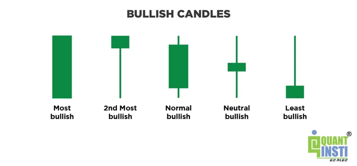

移動平均からAIまでの戦略体系

# 戦略基礎（Strategy Basics）

alpha-market-engine が実装する戦略（strategy）レイヤの体系を「単純 → 高度 → AIモデル」の順に整理する。

---

# 1. シンプル系戦略

## 1.1 移動平均クロス（MA Cross）
- 短期MAが長期MAを上抜け → 買い
- 短期MAが長期MAを下抜け → 売り
- 最も基本的なトレンドフォロー手法

メリット: 実装が簡単
デメリット: ダマシが多い、レンジ相場に弱い

---

## 1.2 ブレイクアウト戦略
- 直近の高値/安値を突破したら買い/売り

メリット: 強いトレンドに乗りやすい
デメリット: フェイクブレイクに弱い

---

## 1.3 RSI戦略
- RSI < 30 → 反発狙いの買い
- RSI > 70 → 反落狙いの売り

---

# 2. 中級戦略（板・約定情報を使用）

## 2.1 板厚分析（Orderbook Imbalance）
- 買い板が厚い時は上昇優勢
- 売り板が厚い時は下降優勢

---

## 2.2 約定速度（Trade Frequency）
- 約定が高速に連続 → トレンドの勢い
- 約定が少ない → レンジ

---

# 3. 上級戦略（時系列モデル）

## 3.1 ARIMA / SARIMA
- 時系列予測の統計モデル
- 仮想通貨では効果は限定的

---

## 3.2 LightGBM / XGBoost
- 板、OHLC、出来高、インジケータから特徴量を作り、短期リターンを分類/予測
- 最も実用性が高い ML 手法

---

# 4. AI戦略（深層学習）

## 4.1 LSTM / GRU（時系列モデル）
- 過去の価格データから次の方向性を予測

---

## 4.2 Transformer
- 高精度な時系列予測が可能
- Binance の板データを使うと高い精度が出るケースも

---

## 4.3 強化学習（Reinforcement Learning）
- Agent が取引を通して最適政策を学習する
- 実市場では難易度が高く管理が必要

---

# 5. alpha-market-engine の戦略層設計方針

- 初期戦略：MA Cross、Breakout
- 中級：Orderbook Imbalance
- 上級：LightGBM
- 将来：Transformer / RL

戦略は `/strategy/` で切替可能なプラグイン方式で実装する。


# ローソク足とは

ローソク足（Candlestick）は、一定時間の値動きを1本の図形で表したもの。

1本のローソク足には、次の情報が含まれます：

- 始値（Open）：期間の最初に取引された価格
- 高値（High）：期間中の最高価格
- 安値（Low）：期間中の最安価格
- 終値（Close）：期間の最後に取引された価格

これらを一本の“ロウソクのような形”で可視化しています。

## ローソク足の構造


### 基本構造
```
陽線：価格が上昇した場合

  │← 高値（High）
 ┌┴┐
 │ │ ← 実体（Body）
 │ │     始値 < 終値（陽線）
 └┬┘
  │← 安値（Low）

価格が下落した場合
  │← 高値（High）
 ┌┴┐
 │ │ ← 実体（Body）
 │ │     終値 < 始値（陰線）
 └┬┘
  │← 安値（Low）
```
ローソクのような

### ローソク足の色
色の違いは "上がったか"、 "下がったか"。

陽線（上昇）：白 or 緑
陰線（下落）：黒 or 赤

### ローソク足で何がわかるか？

ローソク足1本を見るだけで、以下がわかります。
- 市場が“強かったか / 弱かったか”
- 高値圏で売られたのか、安値圏で反発したのか
- ボラティリティが大きかったか（ヒゲが長いほど乱高下）


ヒゲが長い → その方向に否定された値動きがあった
小さな実体 → 方向感が少ない
連続陽線 → 上昇トレンド
連続陰線 → 下落トレンド

### ローソク足の種類 (時間足)

同じ BTC/JPY でも、ローソク足は「時間」で区切り方が変破ります。

- 1分足：1分間の値動きを1本に
- 5分足：5分間
- 1時間足：1時間
- 日足：1日

短い足 → 高速トレード・スキャルピング向け
長い足 → 中長期のトレンド確認


### ローソク足の生成

リアルタイムで受け取る約定データから以下のフローで生成する

1. WebSocketで約定データを受け取る
2. Timestamp（→時間バケット）で分類
3. OHLCV をリアルタイム生成
4. 1本が完成したら戦略ロジックに渡す

つまりローソク足は WebSocketからの原始データを“時間でまとめたもの”。


### ローソク足の重要性

ローソク足がなぜ重要なのかの理由は次の通り：

- 市場の心理を視覚化できる
- インジケータ（MA, RSI, MACDなど）を計算できる
- AIモデルの入力としても有用
- トレーダーの世界標準フォーマット

すべてのトレーダー、すべての自動売買システムがOHLCVを使います。


## ローソク足の種類

### ピンバー (Pin bar)

<!--  -->


方向の否定のシグナルと言われる
- 下ヒゲが長い → 下落を否定（反発の兆候）
- 上ヒゲが長い → 上昇を否定（反落の兆候）

心理としては「その方向に動いたが、途中で強烈に押し返された」状態。

### 包足 （Engulfing）




小さなローソクを 次のローソクが完全に包み込む 形。

- 陽線が陰線を包む → 上昇転換の可能性
- 陰線が陽線を包む → 下落転換の可能性

心理としては
「勢力交代」「流れが変わった」状態。

### 寄引同時線（Doji）




始値と終値がほぼ同じで、ヒゲだけある形。
方向感がない市場。

- 意味：迷い、均衡、トレンドの休憩
- トレンド中の Doji → 反転の予兆になることも

### 大陽線・大陰線





- 一方向に大きく伸びて実体が長い
- 市場の強いエネルギーを象徴

心理としては：

- 大陽線 → 買いが圧倒的
- 大陰線 → 売りが圧倒的

## ローソク足パターンの読み方と市場心理

- 長い下ヒゲ
  - 一度は売られた
  - しかし強い買い戻しが入った
  - 買い勢力が優位に転じている

→ 下ヒゲの長さ = 買いの強さ

- 包み足
  - 前の勢力(トレンド)を完全に飲み込んだ
  - 勢いが逆方向に切り替わった

→ 転換のシグナル

- Doji
  - 買いと売りのエネルギーが拮抗
  - トレンドが一旦止まる
  - その後の大きな動きの前触れになることも

→ 方向喪失・休憩

- 大陽線・大陰線 →
  - 一部の大口ではなく、“市場全体”が同方向に動いた状態
  - 継続しやすい（トレンドフォロー向け）

## ローソク足から AI 向け特徴量を作る方法

AIモデル（LightGBM / Transformer）で勝負したいなら、
ローソク足から一歩踏み込んだ特徴量を作る必要があります。

代表的なものをざっくり挙げます：

### ① ローソク足の形状の数値化（これが超重要）

- 実体の長さ（|Close - Open|）
- 上ヒゲの長さ（High - max(Open, Close)）
- 下ヒゲの長さ（min(Open, Close) - Low）
- ヒゲ率（ヒゲの長さ ÷ 全体の長さ）

AIに「陽線」「ピンバー」と言っても通じないので、
形状を数値で渡すことで特徴が理解できる。

### ② ボラティリティ

- True Range（高値–安値）
- ATR（平均ボラティリティ）

### ③ 勢い（Momentum）

- Close 比（前足の終値と比べての変化率）
- 連続陽線 / 連続陰線のカウント

### ④ 出来高特徴量（Volume）

- Volume
- Volume の前足比
- Volume spike（出来高急増）

### ⑤ 直近数本のローソクをまとめて1つの特徴セットにする

Transformer系は「直近 8〜32 本のローソク足シーケンス」を入れると機能する。