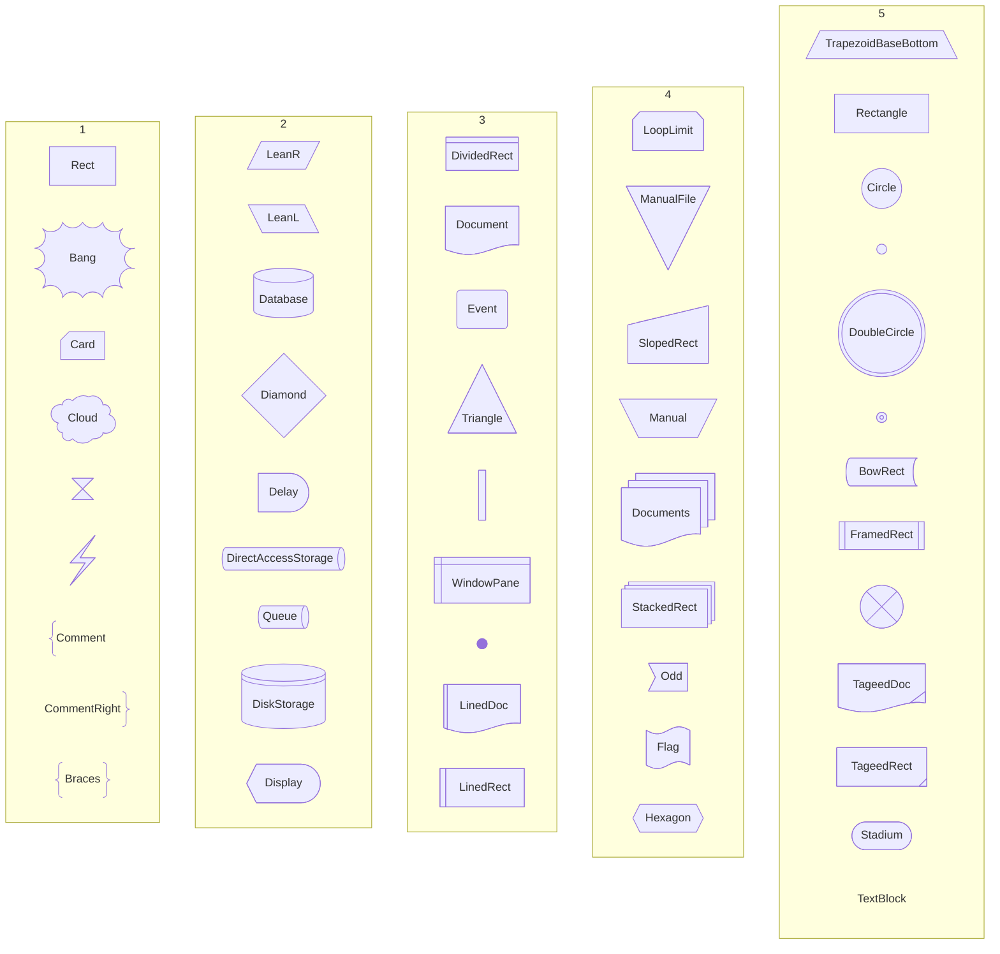

```mermaid
flowchart TD

subgraph "1"
Rect@{ shape: rect }
Bang@{ shape: bang }
Card@{ shape: notch-rect }
Cloud@{ shape: cloud }
Collate@{ shape: hourglass }
ComLink@{ shape: bolt }
Comment@{ shape: brace }
CommentRight@{ shape: brace-r }
Braces@{ shape: braces }
end

subgraph "2"
LeanR@{ shape: lean-r }
LeanL@{ shape: lean-l }
Database@{ shape: cyl }
Diamond@{ shape: diam }
Delay@{shape: delay}
DirectAccessStorage@{shape: h-cyl}
Queue@{shape: das}
DiskStorage@{shape: lin-cyl}
Display@{shape: curv-trap}
end

subgraph "3"
DividedRect@{ shape: div-rect }
Document@{ shape: doc }
Event@{ shape: rounded }
Triangle@{ shape: tri }
FilledRect@{ shape: join }
WindowPane@{shape: win-pane}
Junction@{shape: junction}
LinedDoc@{shape: lin-doc}
LinedRect@{shape: lin-rect}
end

subgraph "4"
LoopLimit@{ shape: loop-limit }
ManualFile@{ shape: flip-tri }
SlopedRect@{ shape: sl-rect }
Manual@{ shape: trap-t }
Documents@{shape: docs}
StackedRect@{shape: st-rect}
Odd@{shape: odd}
Flag@{shape: flag}
Hexagon@{shape: hex}
end

subgraph "5"
TrapezoidBaseBottom@{ shape: trap-b }
Rectangle@{ shape: rect }
Circle@{ shape: circle }
SmallCircle@{ shape: sm-circ }
DoubleCircle@{ shape: dbl-circ }
FramedCircle@{ shape: fr-circ }
BowRect@{ shape: bow-rect }
FramedRect@{ shape: fr-rect }
CrossedCircle@{ shape: cross-circ }
TageedDoc@{ shape: tag-doc }
TageedRect@{ shape: tag-rect }
Stadium@{ shape: stadium }
TextBlock@{ shape: text }
end

```
