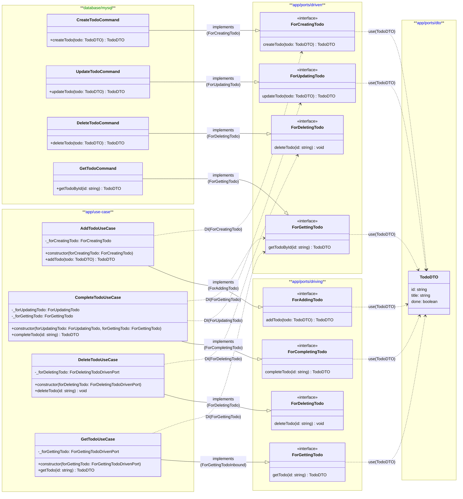

# Ports & Adapters (ヘキサゴナルアーキテクチャ) について

## フロー図

Domain/UseCase であるアプリケーションは Port しか知らず、
外部接続は Adapter しか知らない


この設計において、Port はその境界の形状 (interface) を決めるだけではなく、
依存の方向も決定することが責務として持たれる
- Domain/UseCase 側から Port を依存する関係
- 外部処理は Adapter を依存する関係
のように内、外の関係を作ることが必要です。


Port は単なる interface ではない
| 項目    | interface | port  |
| ----- | --------- | ----- |
| 実装    | 持たない      | 持たない  |
| 目的    | 型の抽象化     | 境界の定義 |
| 依存方向  | 任意        | 固定    |
| 設計意図  | 薄い        | 強い    |
| テスト境界 | 不明確       | 明確    |


## 　TODO処理を参考に

### ディレクトリ階層

```
.
├── app/
│   ├── ports/
│   │   ├── driving/
│   │   │   ├── for-adding-todo.ts
│   │   │   ├── for-completing-todo.ts
│   │   │   ├── for-deleting-todo.ts
│   │   │   └── for-getting-todo.ts
│   │   ├── driven/
│   │   │   ├── for-creating-todo.ts
│   │   │   ├── for-deleting-todo.ts
│   │   │   ├── for-updating-todo.ts
│   │   │   └── for-getting-todo.ts
│   │   └── dto/
│   │       └── todo-dto.ts
│   └── use-cases/
│       ├── add-todo-use-case.ts
│       ├── complete-todo-use-case.ts
│       ├── delete-todo-use-case.ts
│       └── get-todo-use-case.ts
└── database/
    └── mysql/
        ├── create-todo-command.ts
        ├── update-todo-command.ts
        ├── delete-todo-command.ts
        └── get-todo-query.ts
```


> [!TIP] ポートのディレクトリ名
> ポートのディレクトリ名に `driving` と `driven` というそのままの名前を使いましたが、
> 他にもよく使われるものでは `inbound`/`outbound`、`use-case`/`repository` などがあります。
> また ports というディレクトリだけ用意して、`use-case`/`export`/`repository`/`mailer`/`logger` など、
> より具体的な名前をつける様にしてもいいかもしれません。
> これらは名前から `Driving` なのか `Driven` なのかは明白だからです。

### クラス図
Driving Port は、アプリケーション側でどのような振る舞いを行なうのかを定義しています。
Driven Port は、外部接続との境界を定義してその内容は外部ノードへの通信を行なう振る舞いを定義しています。

例えば `AddTodoUseCase` は、Driving Port で定義された `ForAddingTodo` を実装します。
実装するメソッドの `addTodo` の処理内容は Driven Port である `ForCreatingTodo` を DI して、外部接続用のメソッドを実行するといった内容です。
これはつまり、アプリケーション側では契約の境界をつかって処理を実行しているが、
接続のための処理はまったく内側からは見えないというヘキサゴナルアーキテクチャに則った方針を実現しています。



pots は、契約を定義します。この定義が決まることによりアプリケーション側、外部接続側での実装が決まっていきます。

**Ports**
- 設計を固定するためのクラス
- 明示的に interface / 抽象として現れる

**Adapters**

- Port を 実装する具体クラス
- 名前は技術・用途ごとにバラバラ
- 「Adapter」という名前を持たないことが普通

今回でいうと
> [!NOTE] Adapters クラスとは？
> P&A アーキテクチャにおいて、Adapters という名前をつけたクラスは定義していませんでした。
> 実際には、Ports によって定義した形式(interface)をつかって実装されたクラスのことを指します。
> 今回でいうと、`app/use-case` 配下の Driving Ports を実装したクラス、
> `database/mysql` 配下の Driven Ports を実装したクラスがそれに当たります。


## 用意したクラスの配線

ポートやアダプターといった言葉から必要なクラスを用意できましたが、
ここから、用意したクラスの結束をして配線を行なう処理(設定)が必要となります。

フレームワークですでに用意していることもあります。(たとえば、Laravel なら `config/*.php` など)
例えば、以下のように配線を組む設定クラスを用意することができます。
```ts
// app/configulater.ts
export class Configulater {

    private _drivenPorts: {
        forCreatingTodo: ForCreatingTodo;
        forUpdatingTodo: ForUpdatingTodo;
        forDeletingTodo: ForDeletingTodo;
        forGettingTodo: ForGettingTodo;
    }

    public constructor(drivenPorts: {
        forCreatingTodo: ForCreatingTodo;
        forUpdatingTodo: ForUpdatingTodo;
        forDeletingTodo: ForDeletingTodo;
        forGettingTodo: ForGettingTodo;
    }) {
        this._drivenPorts = { ...drivenPorts };
    }

    public drivenPorts = () => { ...this._drivenPorts };
}
```
さらい Application クラスが生成されるときに、外部接続処理のインスタンスを作成するようにします。
```ts
// app/facade.ts
export class Application {

    private _config: Configuater;

    public constructor(config: Configuater) {
        this._config = config;
    }

    public forAddingTodo = (): ForAddingTodo => {
        return new AddTodoUseCase(this._config.drivenPorts().forCreatingTodo);
    }

    public forCompletingTodo = (): ForCompletingTodo => {
        return new CompleteTodoUseCase(
            this._config.drivenPorts()forUpdatingTodo,
            this._config.drivenPorts().forGettingTodo);
    }

    public forDeletingTodo = (): ForDeletingTodo => {
        return new DeleteTodoUseCase(this._config.drivenPorts().forDeletingTodo);
    }

    public forGettingTodo = (): ForGettingTodo => {
        return new GetTodoUseCase(this._config.drivenPorts().forGettingTodo);
    }
}
```
これで、アプリケーションを起動させるときに
```ts
const app = new Application(
    new Configuater({
        forCreatingTodo: new CreateTodoCommand(),
        forUpdatingTodo: new UpdateTodoCommand(),
        forDeletingTodo: new DeleteTodoCommand(),
        forGettingTodo: new GetTodoQuery(),
    })
);

const todo = app.forAddingTodo.addTodo({
    id: '',
    title: 'Todo1',
    done: false,
});

app.forCompletingTodo.completeTodo(todo.id);

app.forDeletingTodo.deleteTodo(todo.id);
```

このように仕組むことで、設定クラスでアダプタクラスを切り替えることで外部ノードを変更することができます。


## 参考
- [Ports & Adapters パターン：Hexagonal Architecture Explained を手元に](https://zenn.dev/kkatou/articles/ports-and-adapters-explained)
