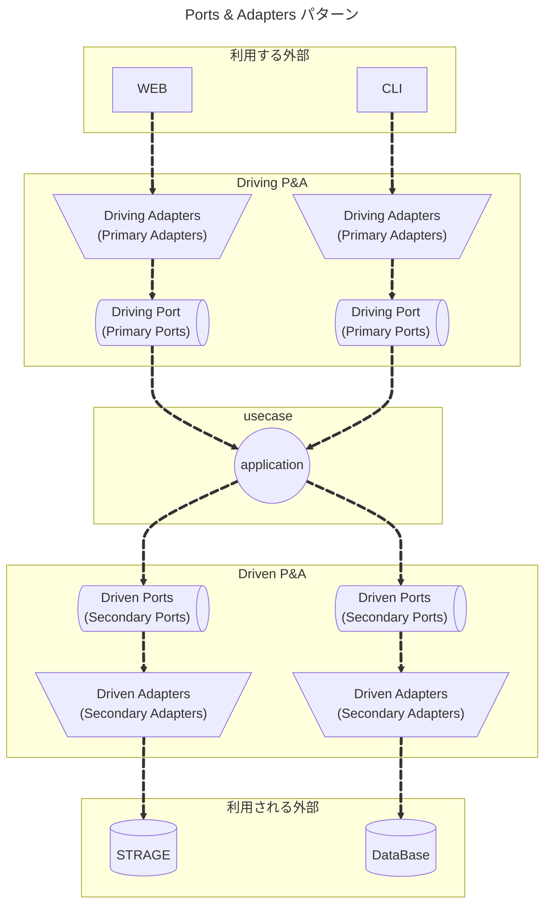

```mermaid
---
title: Ports & Adapters パターン
---
flowchart TB


subgraph 利用する外部
direction RL
    web[WEB]
    cli[CLI]
end

subgraph 利用される外部
    str[(STRAGE)]
    db[(DataBase)]
end

subgraph Driving P&A
    pa1@{ shape: trap-t , label: 'Driving Adapters<br>(Primary Adapters)'}
    pa2@{ shape: trap-t , label: 'Driving Adapters<br>(Primary Adapters)'}
    pp1@{ shape: das , label: 'Driving Port<br>(Primary Ports)'}
    pp2@{ shape: das , label: 'Driving Port<br>(Primary Ports)'}

end

subgraph Driven P&A
    sa1@{ shape: trap-t , label: 'Driven Adapters<br>(Secondary Adapters)'}
    sa2@{ shape: trap-t , label: 'Driven Adapters<br>(Secondary Adapters)'}
    sp1@{ shape: das , label: 'Driven Ports<br>(Secondary Ports)'}
    sp2@{ shape: das , label: 'Driven Ports<br>(Secondary Ports)'}
end

subgraph usecase
    app((application))
end

web e1@==> pa1 e2@==> pp1 e3@==> app
cli e4@==> pa2 e5@==> pp2 e6@==> app

app e7@==> sp1 e8@==> sa1 e9@==> str
app e10@==> sp2 e11@==> sa2 e12@==> db

%% animate
e1@{ animate: true }
e2@{ animate: true }
e3@{ animate: true }
e4@{ animate: true }
e5@{ animate: true }
e6@{ animate: true }
e7@{ animate: true }
e8@{ animate: true }
e9@{ animate: true }
e10@{ animate: true }
e11@{ animate: true }
e12@{ animate: true }
```
