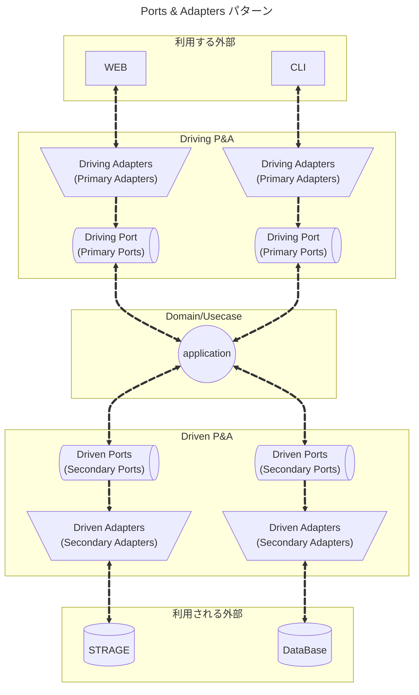
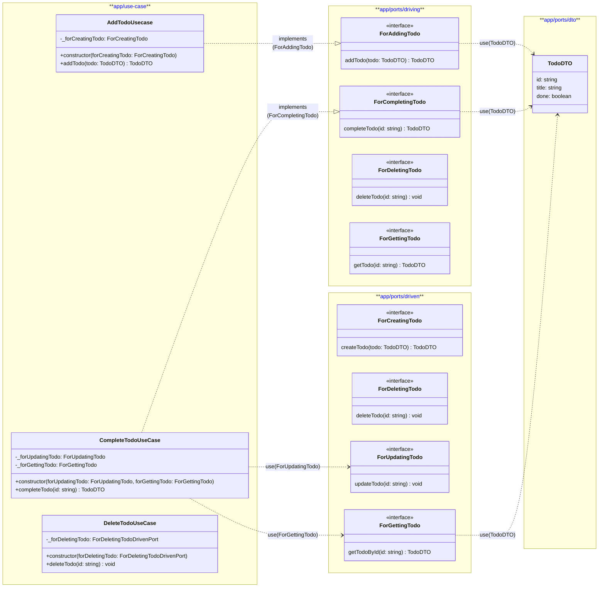

Domain/Usecase であるアプリケーションは Port しか知らず、
外部接続は Adapter しか知らない


この設計において、Port はその境界の形状 (interface) を決めるだけではなく、
依存の方向も決定することが責務として持たれる
- Domain/Usecase 側から Port を依存する関係
- 外部処理は Adapter を依存する関係
のように内、外の関係を作ることが必要です。

```

```

Port は単なる interface ではない
| 項目    | interface | port  |
| ----- | --------- | ----- |
| 実装    | 持たない      | 持たない  |
| 目的    | 型の抽象化     | 境界の定義 |
| 依存方向  | 任意        | 固定    |
| 設計意図  | 薄い        | 強い    |
| テスト境界 | 不明確       | 明確    |


## 　TODO処理を参考に

### ディレクトリ階層

```
.
└── app/
    └── ports/
        ├── driving/
        │   ├── for-adding-todo.ts
        │   ├── for-completing-todo.ts
        │   ├── for-deleting-todo.ts
        │   └── for-getting-todo.ts
        └── dto/
            └── todo-dto.ts
```


> [!TIP] ポートのディレクトリ名
> ポートのディレクトリ名に `driving` と `driven` というそのままの名前を使いましたが、
> 他にもよく使われるものでは `inbound`/`outbound`、`use-case`/`repository` などがあります。
> また ports というディレクトリだけ用意して、`use-case`/`export`/`repository`/`mailer`/`logger` など、
> より具体的な名前をつける様にしてもいいかもしれません。
> これらは名前から `Driving` なのか `Driven` なのかは明白だからです。

### クラス図



pots は、契約を定義します。この定義が決まることにより
